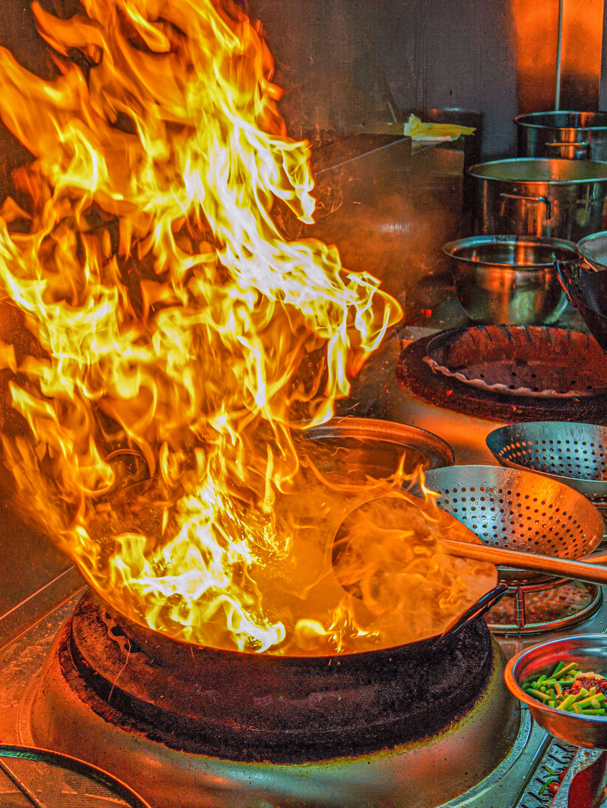
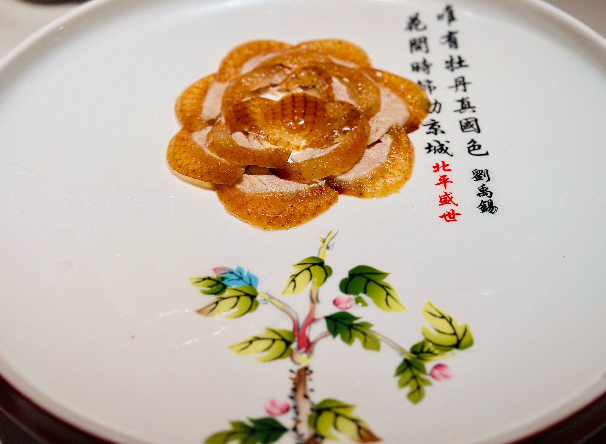

# **Chinese Cooking Techniques**

Chinese cuisine employs diverse cooking methods, including **stir-fry, deep-fry, steam, boil, stew, braise, roast, pan-fry** and so on. Now, let's learn about specific cooking methods through several delicious dishes together! ٩(ˊᗜˋ*)و

## **🥘 Stir-fry: Kung Pao Chicken**

**📍Location**: Mysweet in the second teaching building in the east area.

🍗To make Kung Pao Chicken, the first step is to dice the chicken breast into small pieces, which is like giving the chicken a “weight-loss surgery”. Then, give the chicken a “massage SPA” with soy sauce, rice wine, and cornstarch to make it super tender! 🔥Pour oil into a hot wok, add minced garlic, ginger, scallions, dried chilies, and Sichuan peppercorns. In an instant, the aroma fills the air, making your mouth water 🤤! Pour the marinated chicken into the wok and stir-fry it quickly, just like letting the chicken have a wild “disco dance” to lock in the juice 💦.

Next, add the “crunchy team” like cucumber, celery, and bell peppers, and toss them a few times to keep them crispy. Sprinkle with roasted peanuts for that amazing nutty crunch 🥜! Finally, pour in the “soul sauce” made from soy sauce, vinegar, sugar, and chili oil, and stir-fry quickly to coat every ingredient with the sauce. Stir-fry over high heat until the sauce thickens slightly and turns into a shiny, glutinous state ✨. The tender chicken, crispy vegetables, and rich flavors blend perfectly, creating an explosion of taste and texture 💥!

!!! tip "♫"
    This cooking method not only **locks in nutrients and juice**, but also perfectly demonstrates how Chinese cooking techniques can turn simple ingredients into a symphony of flavors and textures 🎵( • ᴗ - ) ✧!

## ♨️ Steam: Xiaolongbao

**📍Location:** The first floor of the canteen in the east area

!!! tip "Steaming!"
    🥟Steaming is a magical way of “gently cooking” food with hot steam. It can preserve the original flavor of the food without adding extra fat. It's simply the “ceiling” of healthy cooking 👏!

When making Xiaolongbao, you need to roll thin and elastic wheat flour dough into wrappers, which is like preparing a soft “little quilt” for the filling 🧶. The filling is minced pork mixed with frozen collagen broth, the “secret weapon” of Xiaolongbao. 

-   **Xiaolongbao 🫓**

    ---

    { .float-left }
    
    When steamed, the broth melts into soup 🥣. Wrap the filling in the wrapper and pinch beautiful pleats, just like tying a cute “little braid” for the Xiaolongbao to lock in the soup. Then put them in a bamboo steamer lined with anti-stick pads and steam over boiling water for 8 - 10 minutes ⏳. Under the gentle “caress” of the steam, the wrapper becomes soft and translucent, the meat filling is cooked, and the broth turns into a fragrant soup. It's simply amazing!

This method ensures the **signature balance** of Xiaolongbao: chewy wrappers, tender meat filling, and hot, delicious soup. And it's cooked entirely with steam, without a drop of oil, making it healthy and delicious 😋! Making Xiaolongbao is both a culinary art and a tradition, transforming simple ingredients into a perfect blend of textures and flavors.

## 🔥 Braise: Braised Dongpo Pork

**📍Location:** The first floor of the Yinquan canteen

!!! tip "✨"
    🍖Braised Dongpo Pork, this extremely famous Chinese dish, is the “champion” in the world of braising!

The cooking method of braising involves searing first and then slow simmering, making the meat extremely tender and the flavors more intense. To make Dongpo Pork, first, select high-quality pork belly with distinct layers of fat and lean meat. This is the key to making delicious Dongpo Pork 🌟! 

Cut the pork belly into large pieces and quickly sear them in a hot pan until the surface turns an enticing golden brown (๑ᵔ⤙ᵔ๑), locking in the juice and aroma, just like putting on a “golden armor” for the pork belly ✨. 

- 
- 

Then add the “luxurious sauce” made from soy sauce, Shaoxing wine, rock sugar, and spices like star anise and cinnamon. Submerge the pork belly in the sauce and simmer over low heat for 2 - 3 hours ⏳. 

As time passes, the fat melts, making the meat melt-in-your-mouth tender, and the sauce thickens and shines, just like wrapping a shiny “honey coat” around the meat 🍯.

???+ tip "🌈"
    The slow braising process not only breaks down the connective tissues of the meat but also infuses it with rich, savory-sweet flavors. Every bite is so tender that it seems to dissolve in your mouth. It's an amazing culinary masterpiece that perfectly showcases the magic of braising!

## 🫕 Boil: Biangbiang noodles

**📍Location:** The second floor of the Yinquan canteen

!!! tip "(づ> v <)づ♡"
    🍜Get ready to dive into the delicious world of Biangbiang noodles! Here, the simple art of boiling can transform dough into a mouthwatering delicacy! 

-  **Biangbiang noodles!🌟**

    ---

    

These noodles are the “superstars” of Shaanxi cuisine 🌟. They are thick, hand-pulled, and have an irregular shape, full of personality! The cooking process starts with a “dough party” — flour, water, and a pinch of salt come together, and are kneaded into a smooth and elastic dough, just like playing an interesting “dough magic” 🧙! Then comes the “showtime”! Roll, stretch the dough, and slap it on the counter with a satisfying “biang biang” sound, creating wide, ribbon-like noodles, just like shiny silk ribbons 🎀!

Put the noodles into a large pot of boiling, salted water. They are just like cheerful “swimmers” diving into the pool 🏊! After boiling gently for 5 - 7 minutes, the noodles reach the perfect “al dente” state — chewy yet tender. After draining, dress them up with a vibrant mix of toppings: fiery chili oil, zesty garlic, fresh scallions, and maybe some savory stir-fried veggies or meat. All kinds of flavors “explode” in your mouth, creating a taste carnival 🎉! All of this is thanks to the magic of boiling 🔮!

## 🍗 Roast: Zhejiang University Roast Duck

**📍Location:** The second floor of the Yinquan canteen

🦆Roasting is like giving a duck a luxurious “crispy makeover”, and Zhejiang University Roast Duck is the ultimate “superstar” of this culinary show 🌟! 

- 

    {.float-left}

    First, the duck gets a special “spa” — air-drying to tighten its skin and remove excess moisture 💨. Then, here comes the highlight! Put the duck into an extremely hot oven, just like sending it into a “magic oven” where the high heat starts working its magic ✨! As it roasts, the skin starts to crackle and turns into a golden-brown, crunchy masterpiece, while the fat inside slowly melts, basting the tender meat below. 

- 

    {.float-right}

    The oven is like a brilliant artist 🖌️, painting the duck with a shiny, caramelized glaze. Once it’s done, chefs skillfully slice it into paper-thin pieces. Served with fluffy pancakes, tangy hoisin sauce, and fresh scallions, each bite is a crispy, juicy explosion of flavor — a delicious ode to the art of roasting!

## 🍳 Pan-fry: Autumn Leaf Pan-Fried Dumplings

**📍Location:** Yishantang in Yuquan campus

🥟Meet the Autumn Leaf Pan-Fried Dumplings, a perfect example of the magic of pan-frying in Chinese cuisine! 

These crescent-shaped cuties are like little golden moons 🌙, ready to conquer your taste buds! (っ˘ڡ˘ς)

The process starts with a “sizzle” — place the dumplings in a hot pan with a drizzle of oil. As they cook, the bottoms turn into a crispy, caramelized crust, and you can hear a satisfying “crunch” with every bite.

Then comes the exciting part: add a splash of water to the pan and quickly cover it. It’s like a mini steam show inside the pan 🎩! The steam cooks the top of the dumplings, ensuring the tender pork and chive filling is perfectly cooked. This genius combination of pan-frying and steaming gives these dumplings a dreamy contrast of textures — a crispy base and a soft, juicy upper half, making them an irresistible treat.✨

## 🔪 The Art of "Mandolin Hands" - Shredding Like a Pro

Meet the **"Shredded Potato Ballet"**! Chinese chefs use a lightning-fast vertical slicing technique called *"sī"* (丝) to turn potatoes into matchstick-thin threads 🥔→✨. 

It's like watching a culinary magic show – one wrong move and you get potato confetti instead of stir-fry-ready strands! This technique isn't just pretty; it ensures even cooking and maximum sauce absorption. 

???+ tip "Pro Tip"
    Keep those fingertips curled like a sleepy sloth 🦥 to avoid becoming human sashimi.(ó﹏ò｡)

## 🔥 Wok Hei Whispers - The Dragon's Breath Cookery

Ever wondered how street vendors make **"Blistered Green Beans"** taste like heaven? Enter *"bào chǎo"* (爆炒), where ingredients meet 500°C wok surfaces in a fiery tango! 🐉💨 

-   **Wok Magic: Bào Chǎo!** 🔥🔥🔥

    ---

    

The secret? A three-act drama🌟: 

-   
💨

    
    ---

    Oil smoking like a grumpy steam engine

-   
🪽

    ---

    Ingredients tossed like pizza dough

-   
❤️‍🔥

    ---

    Flame-kissed edges with juicy centers

It's not cooking – it's pyrotechnics with chopsticks! (≧ᗜ≦)

## 🥄 Sauce Sorcery - The Starch Illusionist

Behold the **"Velvet Eggplant Trick"**! Chinese chefs thicken sauces using a cornstarch-water mix called *"gōu qiàn"* (勾芡). 

- 

    {.float-left}

    When done right, it's like giving your dish a liquid cashmere coat 👗 – glossy, clingy, and ridiculously luxurious. Too much? Congrats, you've made edible glue. Too little? Now it's soup with commitment issues. 

!!! tip "Tip⚖️"
    The golden ratio: 1:6 starch to water, added when the sauce bubbles like a gossipy teapot 🫖!

## 🎨 Plate Picasso - The Dim Sum Da Vinci

Witness the **"Peking Duck Opera"** plating! 

Traditional banquet dishes use symbolic arrangements: duck slices fanned like peacock feathers 🦚, scallion brushes in cucumber "bamboo forests"🎋, and pancake stacks resembling golden ingots. Modern chefs play food Jenga with crispy noodles, carve radish roses 🌹, and paint plates with beetroot "calligraphy". 

Remember: If it looks too pretty to eat, you're doing it right – but chopsticks are the ultimate art critics! 🥢👩🎨
