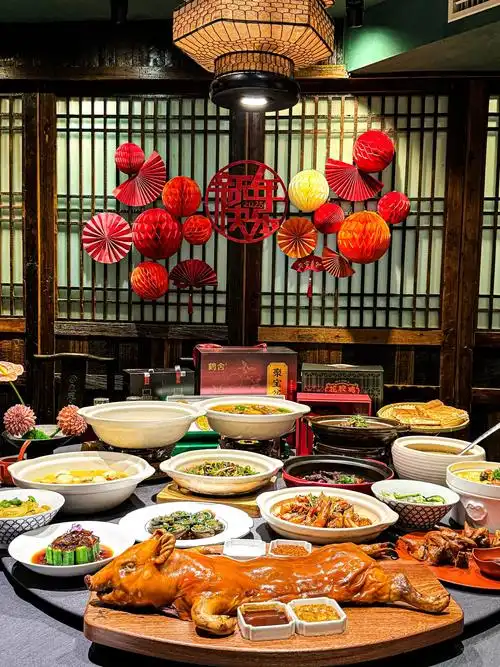
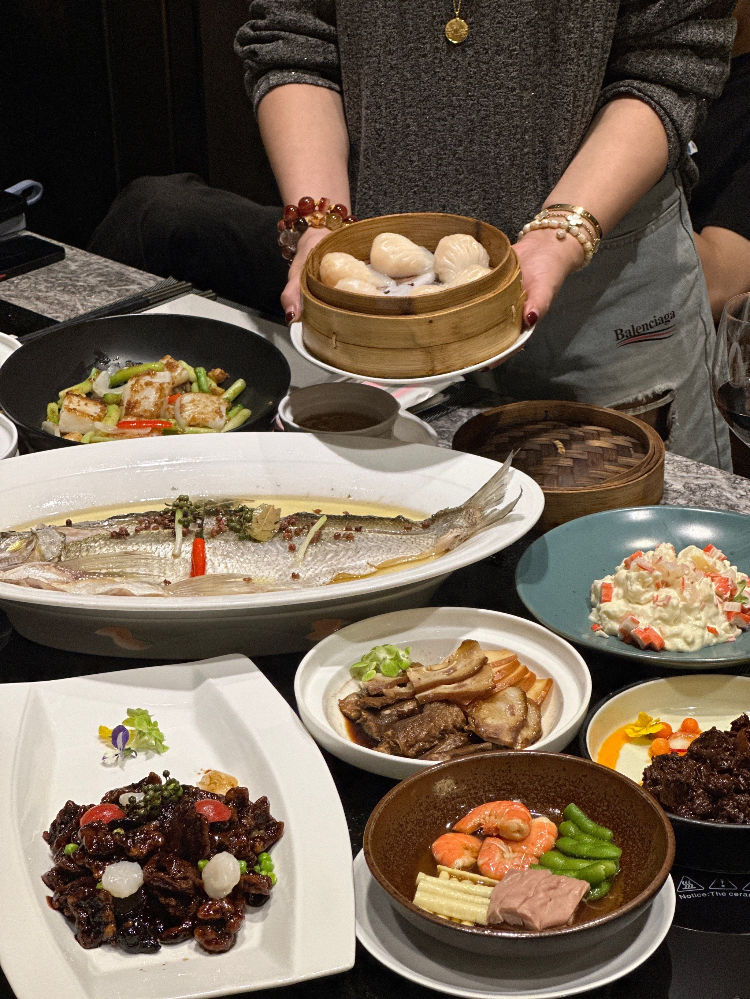
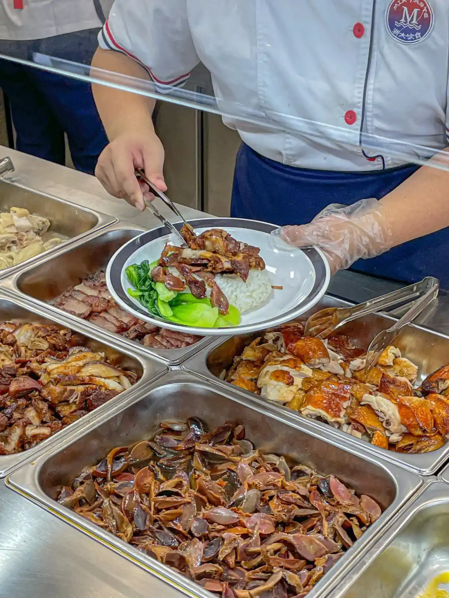
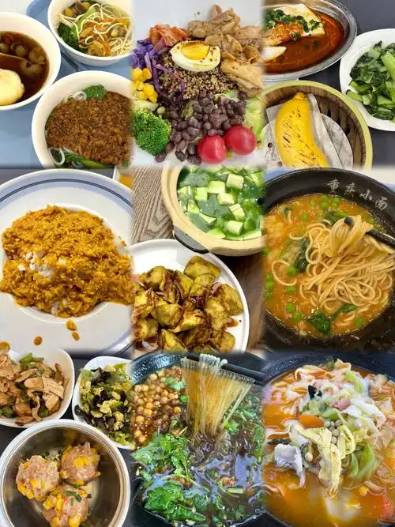
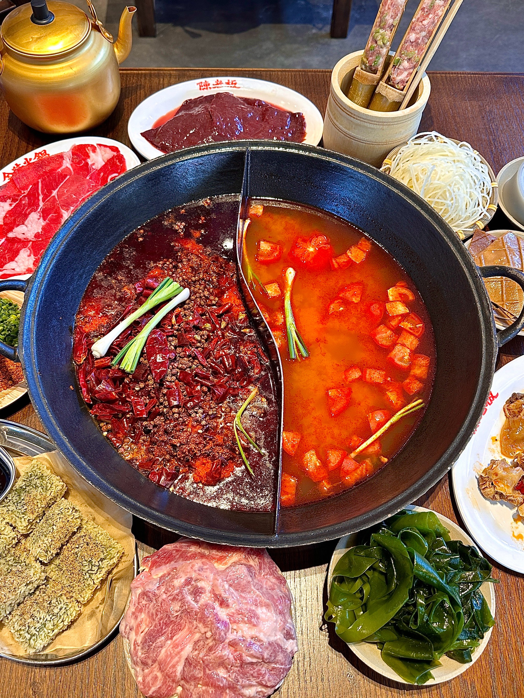
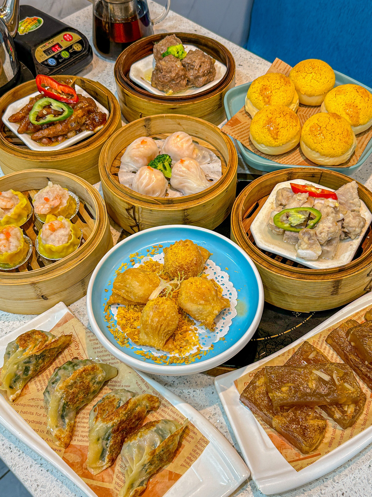
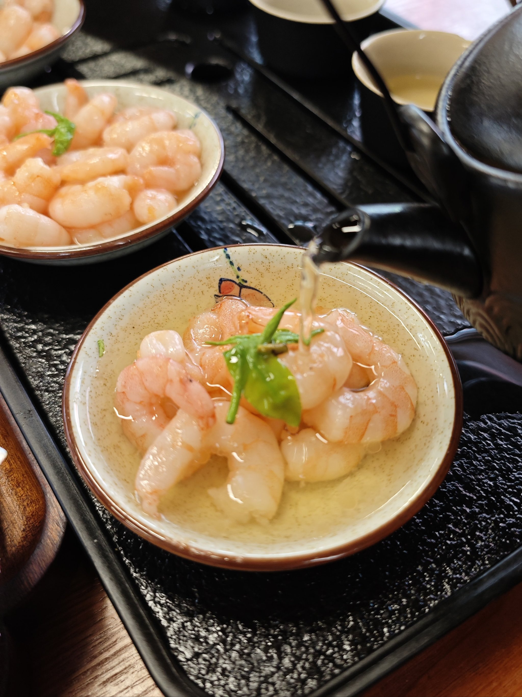
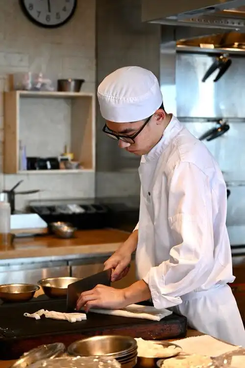
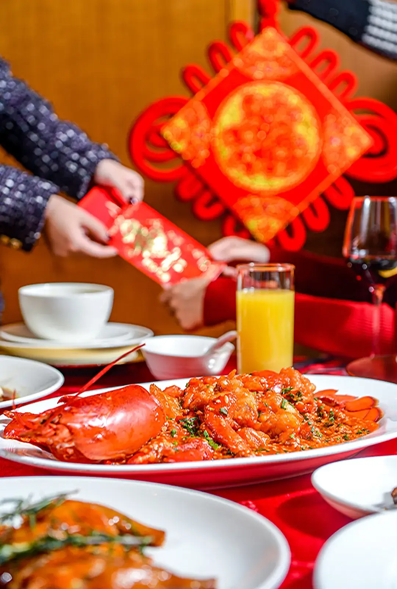
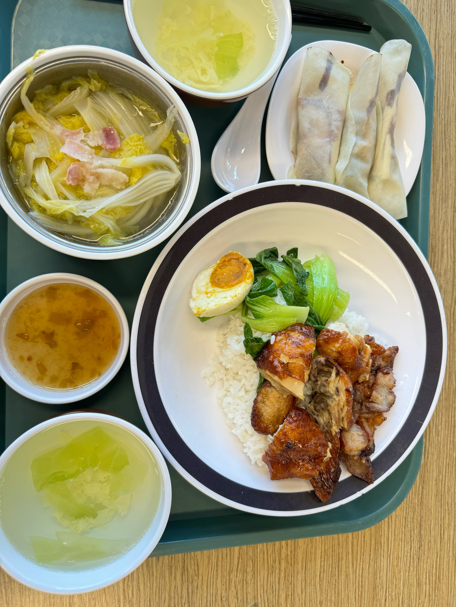

# **Chinese Cuisine**

Chinese culture is vast, profound, and steeped in millennia of tradition. Throughout its long history, the diligent and creative people of China have developed a remarkable array of unique ==**culinary techniques**==, giving rise to a rich and meaningful ==**culinary culture**== that is as much an art as it is a way of life. 

- 

- 

What's more, here at our beautiful ==**ZJU campus**==, you’ll find an incredibly diverse selection of authentic Chinese cuisine just waiting to be explored—each dish telling its own story of regional flavors, time-honored methods, and cultural significance.

- 

- 

From the sizzling woks of Sichuan-style stir-fries to the delicate dim sum traditions of Guangdong, every meal offers a gateway into China’s culinary heritage. Whether it’s a quick bite between classes at a campus canteen or a deep dive into Hangzhou’s famed "West Lake" dishes, your taste buds are in for an unforgettable journey.✨

- 

- 

- 

!!! tip "(づ> v <)づ🌈⛅️✨"
    Can’t wait to begin your adventure? Let’s embark on this flavorful exploration together!(˶ˆᗜˆ˵)

-   **Chinese Cooking Techniques 🍳**

    ---

    
    
    
[Check them!](Chinese Cooking Techniques.md){.md-button}

-   **Chinese Culinary Culture 🪭**

    ---

    

    
[Check them!](Chinese Culinary Culture.md){.md-button}

-   **Chinese Cuisine in ZJU 🏫🌟**

    ---

    

    
[Check them!](Chinese Cuisine in ZJU.md){.md-button}

Follow our guides and tips to navigate ZJU’s dining scene like a local—because great food is best shared, and every bite is a chance to connect with China’s living traditions!🐼🥢