# **Chinese Culinary Culture**

Chinese culinary culture, a treasure trove that has been meticulously crafted over centuries, seamlessly weaves together an explosion of rich flavors and profound symbolic meanings. 

At the heart of this captivating culture lie **two essential elements**: ==**Dining Etiquette** and **Cultural Symbols**==. Join us on this fascinating journey as we peel back the layers of these concepts and uncover how they combine to create the one - of - a - kind dining experience that is uniquely Chinese.🍽️🍜

## Dining Etiquette 🍽️

!!! note
    Chinese dining etiquette is far more than just the act of eating; it is a living, breathing expression of respect, a nod to time - honored traditions, and a vivid manifestation of the values of **harmony** and **collectivism**. While there are delightful regional variations and slight adaptations for different occasions, a set of core principles serves as the guiding compass for sharing and savoring meals.

### Respecting Elders 🧓👵

!!! note
    In the fabric of Chinese society, age and status hold great significance, especially when it comes to the dining table. 

The seating arrangement is a carefully orchestrated dance, with the most prominent seats reserved for elders and esteemed guests. When the meal commences, it is these revered individuals who take the first bite, a simple yet powerful gesture that speaks volumes about the respect deeply ingrained in Chinese culture.

This "hierarchical" order is not just a formality; it is a way of life that ensures elders are always showered with the highest regard. During grand banquets or warm - hearted family gatherings, the most sumptuous dishes are presented to them as a token of love and respect 🥂.

### Shared Dining 🍲

!!! note
    In contrast to the more individualistic dining habits prevalent in some Western cultures, Chinese dining is a celebration of togetherness. 

-   **Shared Dining**

    ---

    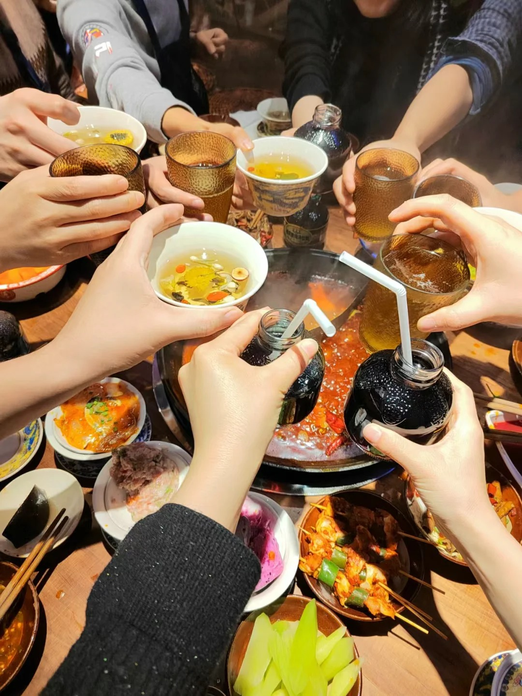{.float-left}

    Picture a table laden with an array of mouthwatering dishes, all placed invitingly in the center. Everyone around the table reaches out with their chopsticks, sharing and savoring the culinary delights.
    
    This communal style of dining is a beautiful reflection of the strong family values and the deep - seated sense of unity in Chinese society. With each bite, food becomes not just sustenance but a powerful symbol that binds people together, creating memories that last a lifetime 👨‍👩‍👧‍👦.

### Chopstick Etiquette 🥢

Chopsticks in China are not mere utensils; they are an integral part of a sacred dining ritual. These slender tools come with a whole set of unwritten rules that are steeped in culture. 

-   
❌

    --- 

    Pointing chopsticks at others is a big no - no, as it is considered rude and disrespectful. 

-   
❌

    ---

    Stirring food in your bowl is also frowned upon, as it disrupts the harmony of the dining experience.

And perhaps the most important rule of all: ==**never stick chopsticks upright into a bowl of rice!**==
!!! question "🤔Why?"
    This seemingly innocent act resembles the **incense** used in religious rituals and is regarded as an ominous sign.( ˶°ㅁ°) !! 

These small but significant details are a testament to the deep - rooted traditions and the respect for others that are at the core of Chinese dining 🙏.

### Toasting and Encouraging Dishes 🍷

Toasting is the lifeblood of Chinese banquets, a time - honored tradition that adds a touch of magic to every gathering. When glasses clink, it's not just a simple exchange of drinks; it's a heartfelt way to convey good wishes and express respect. 

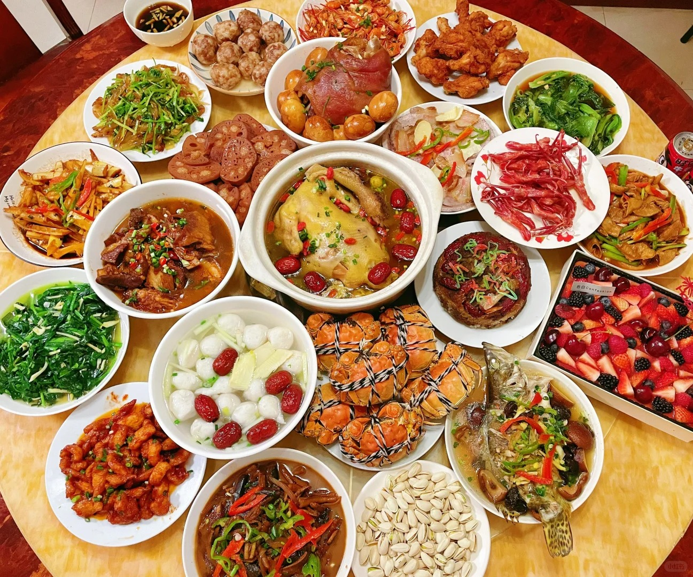

Sharing a toast with guests or elders is like building a bridge of friendship and mutual respect, bringing people closer together. Similarly, the act of **"quàn cài"** (劝菜), or encouraging others to eat more, is a warm - hearted gesture that showcases the Chinese spirit of hospitality. It's a way of saying, "Make yourself at home and enjoy every bite (,,>ヮ<,,)!" 🥂

## Traditional Holiday Foods & Their Cultural Meanings 🎑

!!! note
    Traditional Chinese festivals are not only times for rich folk customs but also for a feast of special foods. Each holiday dish carries its own unique cultural symbolism, becoming an important vessel for expressing emotions and passing down traditions.

### Chinese New Year (春节) 🧨

Chinese New Year, the most important traditional holiday in China, boasts a vibrant and diverse food culture. 

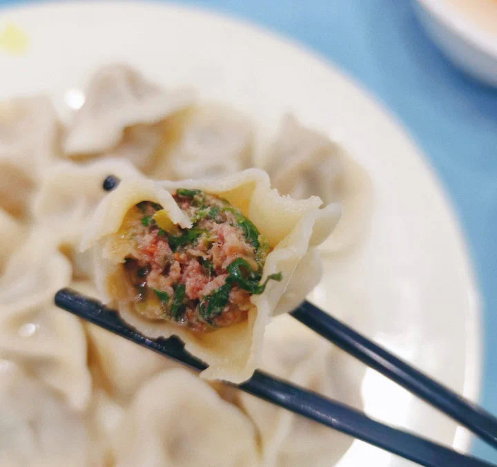

Besides the well-known dumplings 🥟, symbolizing reunion and wealth, another staple is "nian gao" (年糕), or rice cakes, which signify higher achievements in life and career. Then there's "tang yuan" (汤圆), whose round shape represents family reunion and happiness. 

-   **nian gao**

    --- 

    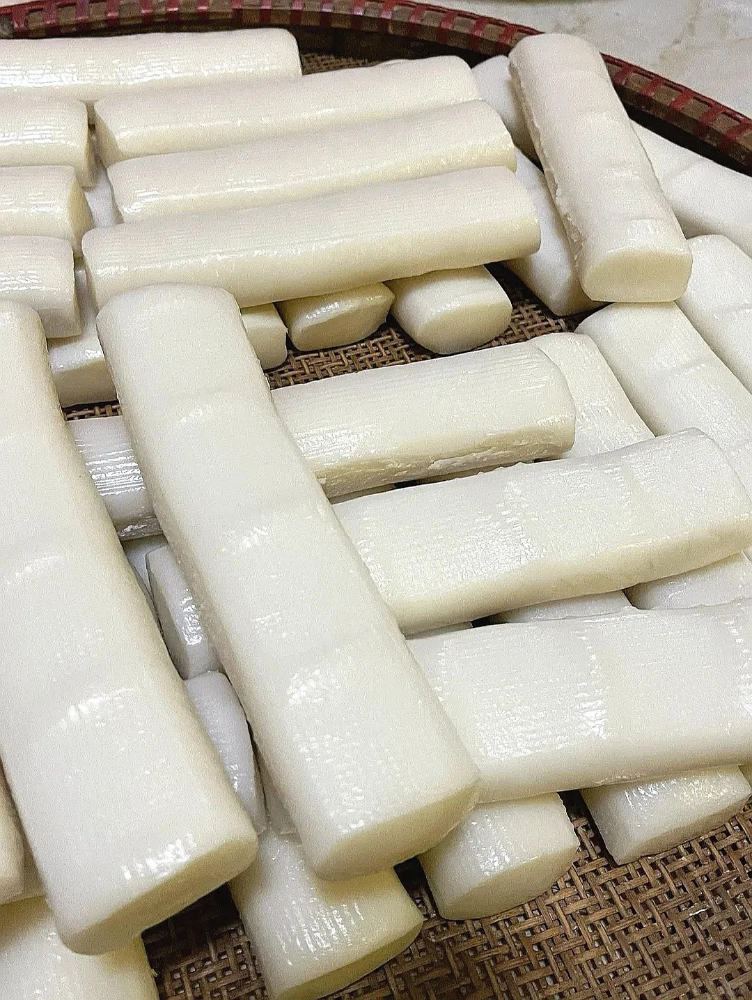

-   **tang yuan**

    ---

    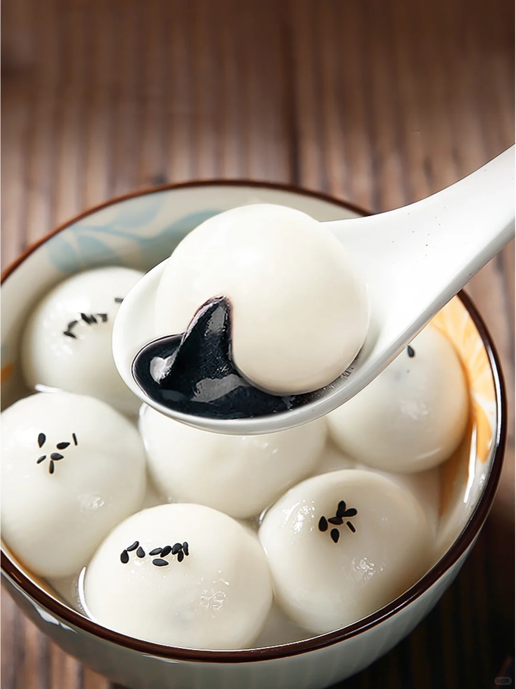

Families gather to enjoy these dishes together, savoring both the food and the sense of familial joy 🏠❤️.

### Lantern Festival (元宵节) 🎇

The iconic food for the Lantern Festival is **"yuan xiao"** (元宵) or **"tang yuan"** (汤圆), sweet glutinous rice balls filled with various fillings, symbolizing unity and happiness.

- 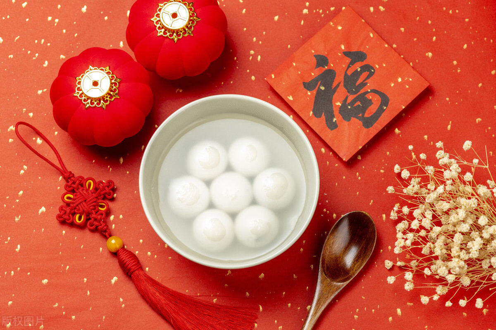
- 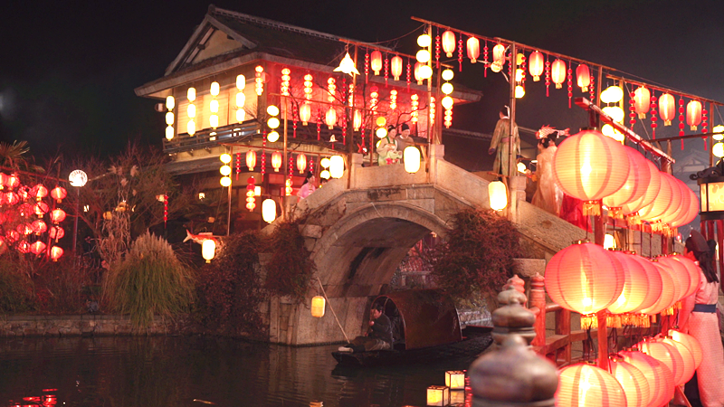

On this day, people not only eat these delicious treats but also celebrate by enjoying lantern displays and guessing lantern riddles, creating an atmosphere of joy and camaraderie.

### Qingming Festival (清明节) 🌱

During the Qingming Festival, "qing tuan" (青团), or green rice dumplings, is a traditional delicacy in the Jiangnan region. 

-   **qing tuan**

    ---

    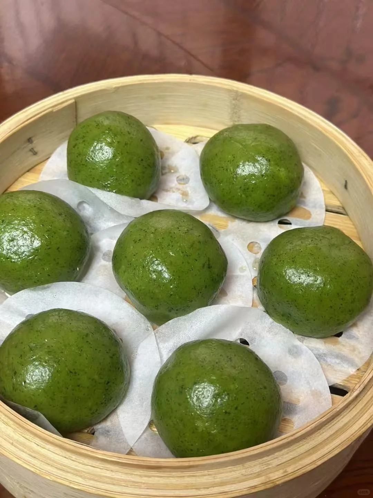{.float-right}

    Made from glutinous rice mixed with fresh mugwort juice, they have a vibrant green color and soft texture. 

    !!! tip "🌿"
        Mugwort is believed to have healing properties, and the dumplings are not only a seasonal treat but also a way to honor ancestors and reflect on life and nature.

### Dragon Boat Festival (端午节) 🎋

When it comes to the Dragon Boat Festival, **"zong zi"** (粽子), or sticky rice dumplings, are the most well-known food. 

-   **zong zi**

    ---

    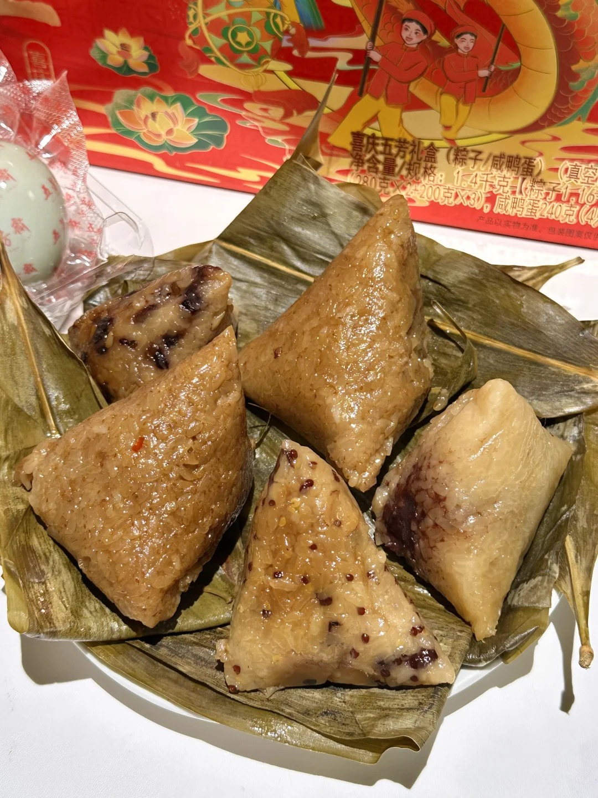{.float-left}

    These dumplings are usually filled with ingredients like salted egg yolk and pork, wrapped in bamboo leaves. 

    !!! tip "🪶"
        The story behind this dish dates back to the poet Qu Yuan, who is said to have thrown himself into the river, and people threw rice dumplings into the water to protect his body from fish. Today, zong zi is not only a festive food but also a symbol of patriotism and cultural heritage.

### Mid-Autumn Festival (中秋节) 🌕

The quintessential food for the Mid-Autumn Festival is **"mooncakes"** (月饼). 

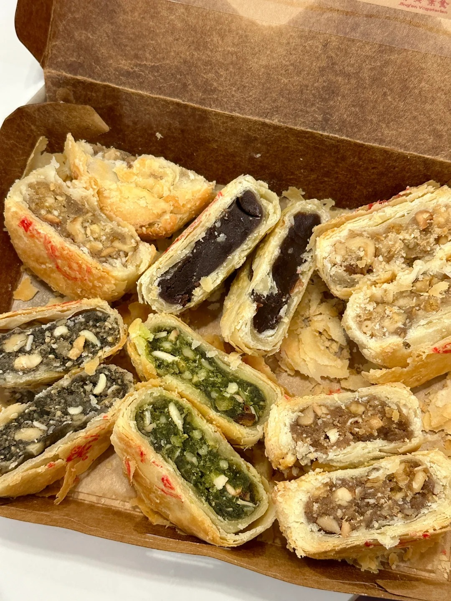

These round cakes symbolize reunion, and they come in a variety of regional styles and flavors.

During the Mid-Autumn night, families gather to appreciate the moon, eat mooncakes, and express longing for loved ones, as well as their wish for a happy and prosperous life.

!!! note
    Mooncakes are often given as gifts to friends and family, symbolizing deep affection.

## Cultural Symbols 🧧

In the enchanting world of Chinese culture, food transcends its role as a source of nourishment and becomes a powerful **medium of communication**. Every ingredient, every cooking method, and every dish on the table is a storyteller, conveying messages of prosperity, harmony, and good fortune.

### Symbolism of Ingredients 🥢

Chinese cuisine is a veritable dictionary of symbols, with many foods carrying profound meanings:

-   **Fish 🐟**

    ---

    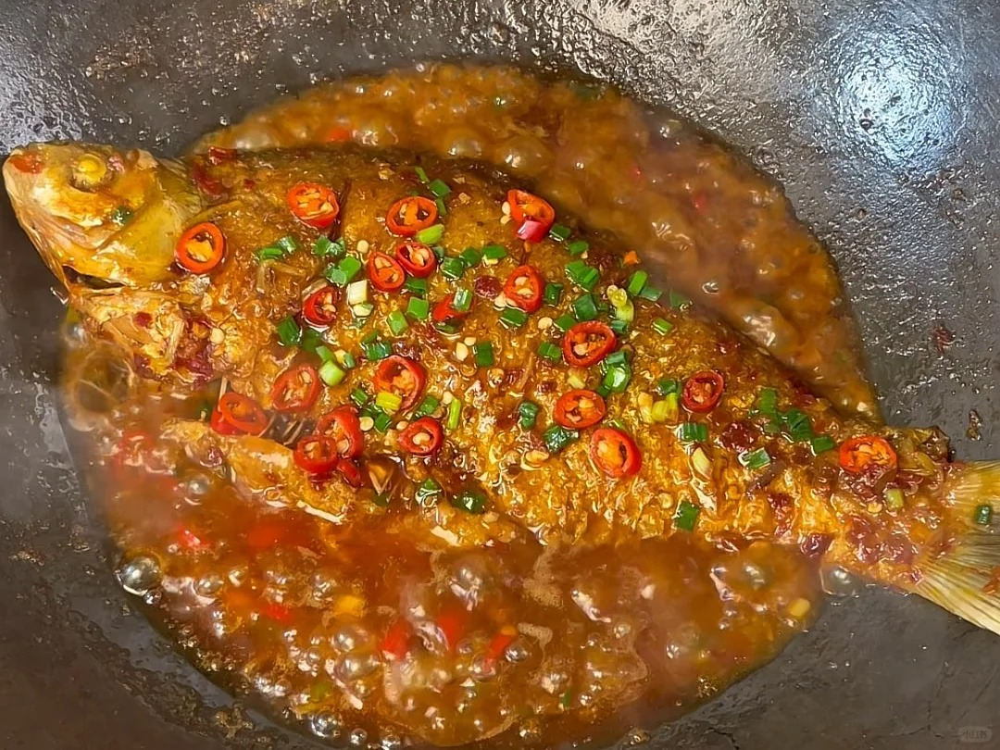{.float-left}

    The Chinese word for fish, "yú", sounds identical to the word for "surplus", making it a powerful symbol of abundance and wealth. 
    
    !!! tip
        During the Chinese New Year, fish is a must - have on the menu, as it is believed to bring prosperity in the coming year.

-   **Dumplings 🥟**

    ---

    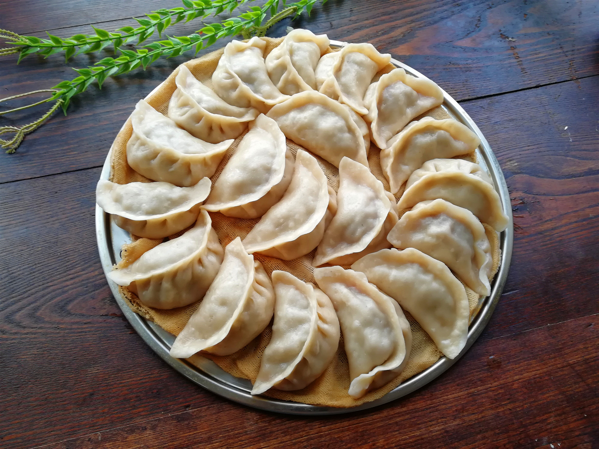{.float-right}

    Especially during the Spring Festival, dumplings take center stage. Shaped like ancient Chinese gold ingots, they represent family reunion and wealth, filling the air with a sense of joy and hope.

-   **Chinese Cabbage 🥬**

    ---

    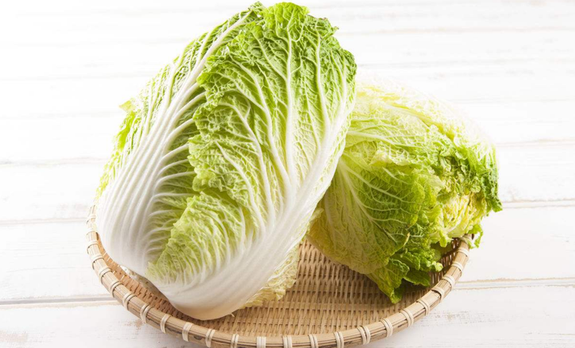{.float-left}

    In some regions, Chinese cabbage is affectionately regarded as a symbol of **good luck**. 
    
    Its name, which sounds like "bǎi cái" (hundreds of riches), is a sweet reminder of the prosperity that lies ahead 🏮.

### Cooking Methods and Their Symbolism 🍲

Cooking methods in Chinese culinary tradition are not just techniques; they are carriers of meaning (⸝⸝> ᴗ•⸝⸝):

-   **Steaming♨️**

    ---

    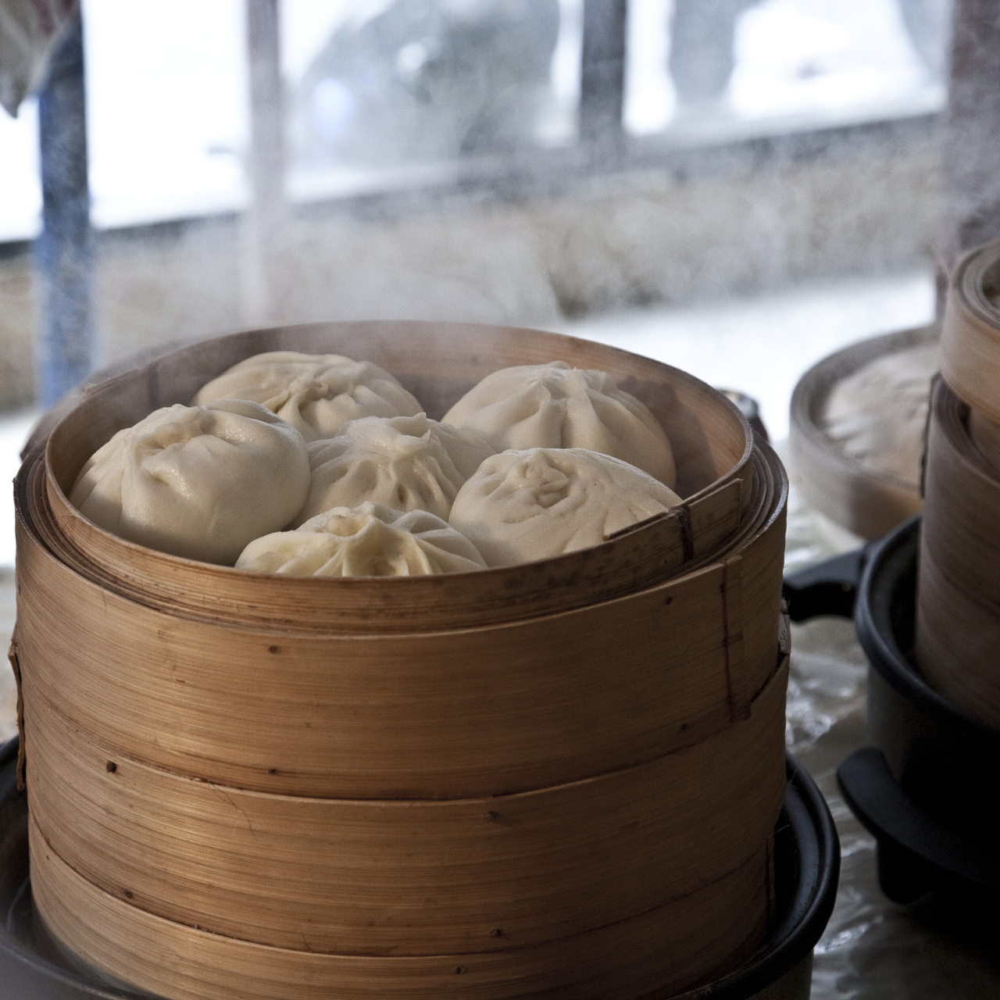{.float-left}

    Steaming, an ancient cooking method, is associated with positive concepts like "rising" and "prospering". During festive occasions and family gatherings, steamed dishes are often served, carrying with them blessings of growth and success.

-   **Red - Braising🍖**

    ---

    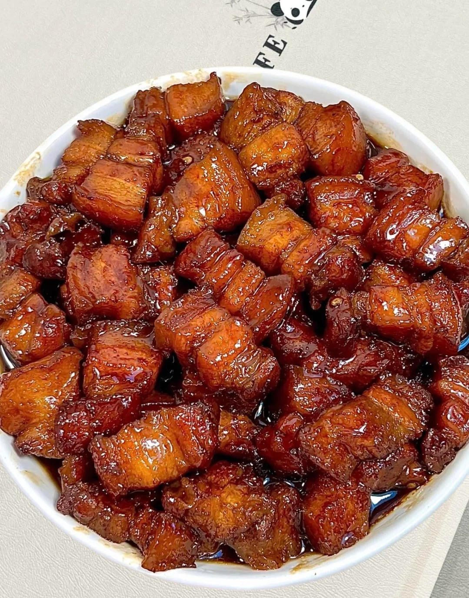{.float-right}

    Dishes cooked in the red - braising style are a feast for the eyes and the taste buds. With their deep, rich flavors and glossy red appearance, they symbolize wealth, luck, and prosperity, adding a touch of opulence to any meal.

### Balance of Color, Aroma, Taste, and Presentation 🎨

Chinese cuisine is a masterpiece of art and science, where the pursuit of flavor is complemented by an equal emphasis on **color, aroma, and presentation.** 

This holistic approach reflects the profound Chinese philosophy of Yin and Yang and the Five Elements. The harmonious balance of these elements in food preparation is a metaphor for the balance that people strive for in life.

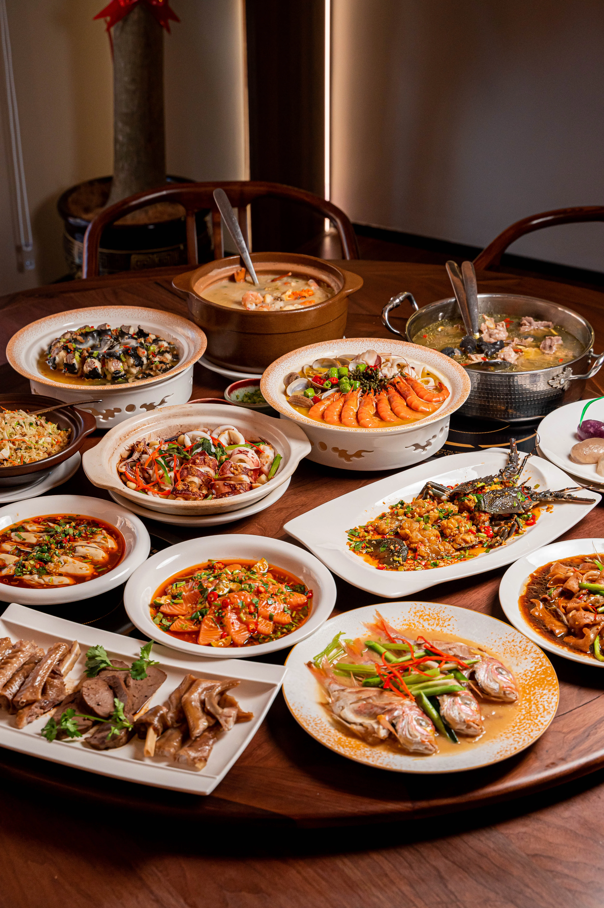

The vibrant colors of the dishes, the tantalizing aromas that fill the air, and the beautifully crafted presentations are all part of a larger cultural understanding of beauty and harmony, making every meal a visual and sensory delight ✨.

### Symbolic Dining Items 🍽️

Beyond the food itself, the items used on the dining table also carry deep cultural significance:

-   **Bowls 🍚**

    ---

    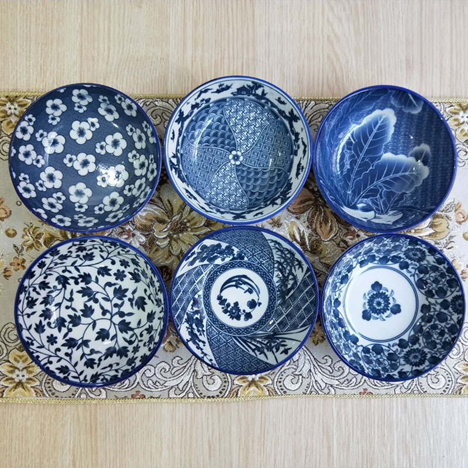{.float-left}

    In Chinese culture, bowls are powerful symbols of family unity. During family meals, especially during festive holidays like the Lunar New Year, the bowl represents the unbreakable bond of togetherness, as everyone shares from the same source.

-   **Tea 🍵**

    ---

    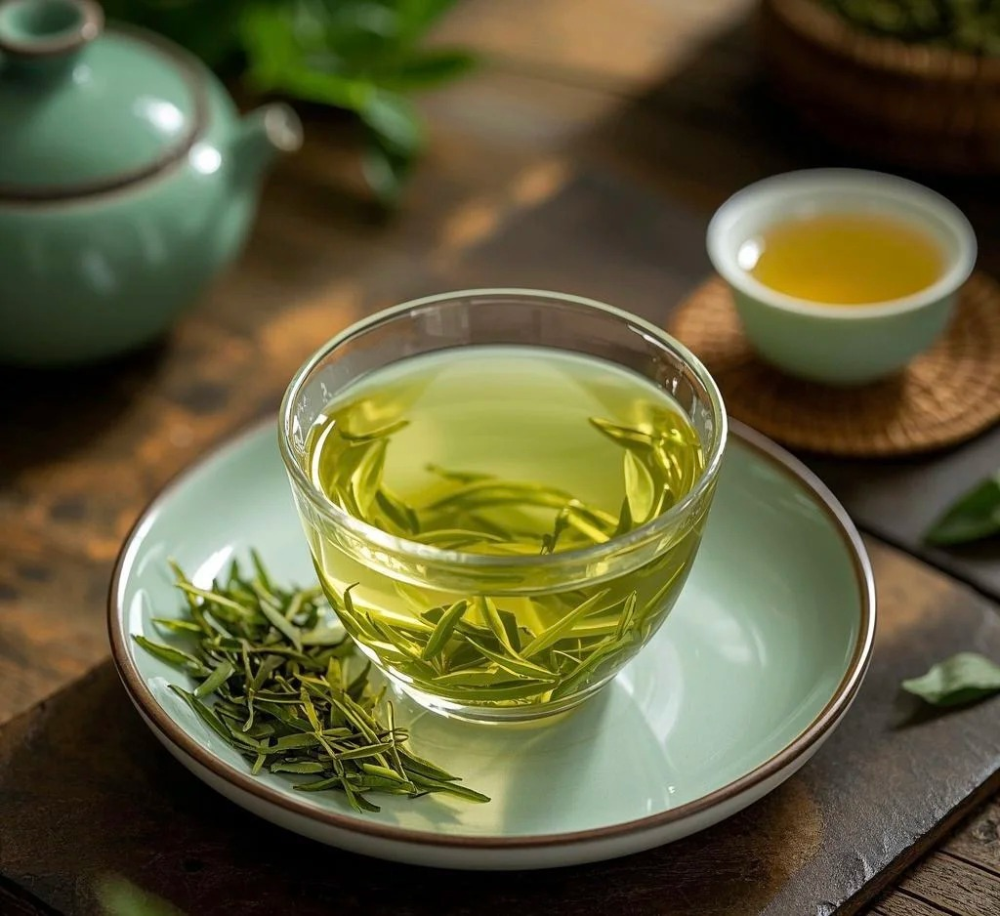{.float-right}

    Tea holds a special place in Chinese culture, serving as more than just a beverage. It is a symbol of hospitality, self - cultivation, and respect. The act of serving tea is a cherished tradition, a warm welcome for guests and a heartfelt expression of gratitude.

-  

## Conclusion 🌟

In Chinese culinary culture, dining etiquette, traditional holiday foods and their cultural meanings, and cultural symbols all come together to create a rich and meaningful dining experience.🥳

-   **🤝 Dining Etiquette**

    ---

    Dining etiquette isn't just about proper utensil use—it's a reflection of deep respect for others and embodies values of harmony and collectivism. 🥂

-   **🪭 Traditional Holiday Food**

    ---

    Traditional holiday foods serve as important vessels for cultural heritage, holding the hopes and wishes of the people while maintaining a strong connection to age-old customs.

    !!! tip
        Each holiday dish is closely tied to its respective festival, acting as a medium for emotional exchange and cultural bonding. 🍜

-   **🏮 Cultural Symbols**

    ---

    Cultural symbols embedded in food—from ingredients to cooking techniques—represent key concepts such as wealth, prosperity, and family unity. 🧧

When these elements converge, they form a vibrant tapestry of tradition, showcasing the depth and charm of ==**Chinese culinary culture**==. 

Here, every meal is an opportunity to connect, express respect, and celebrate life. Whether it's an everyday meal or a grand feast, Chinese dining culture uniquely conveys profound emotions and cultural richness, allowing people to savor not only the food but also the vast heritage behind it. 🍴✨