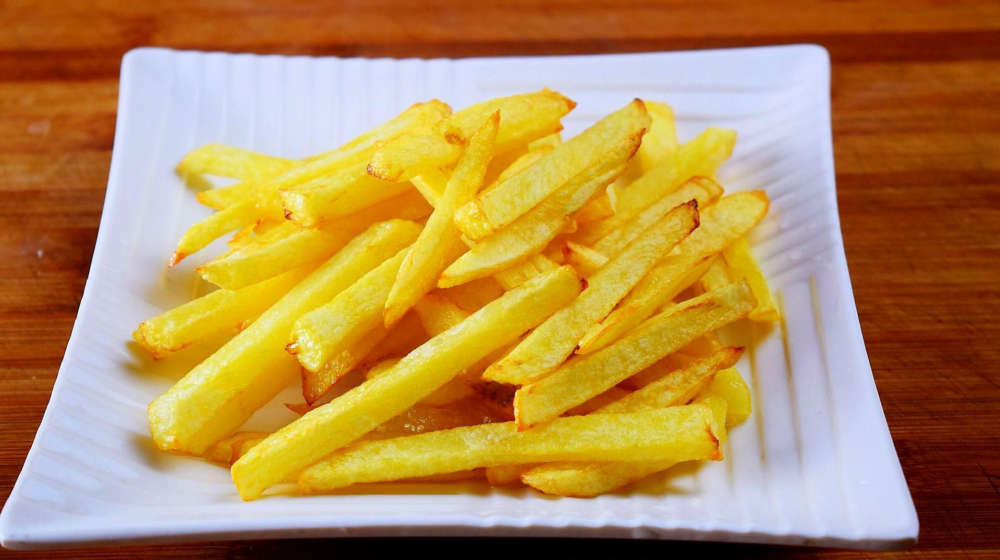
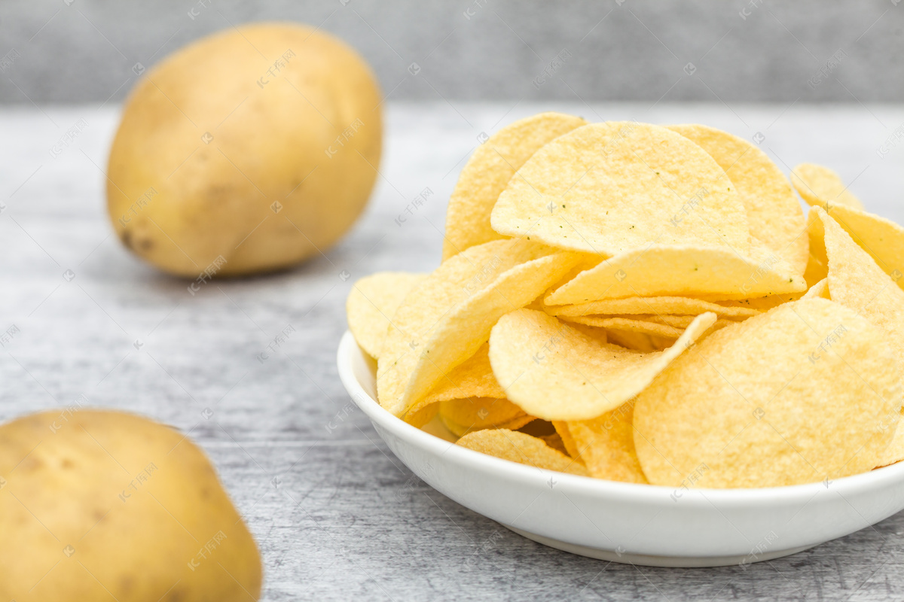

# **Culinary Phonetics**
## Pronunciation of Taste Adjectives

!!! tip "(≧ヮ≦) 💕"
    Let Your Mouth "Taste" the Flavors of Chinese Cuisine! 😋

In Chinese cuisine, food is not just something you eat; it’s an entire sensory experience. Taste adjectives in Chinese are like magic keys that open doors to a world of flavors. Interestingly, these adjectives are not just about meaning—they also convey **sensory experiences** through pronunciation! 

!!! note "🪄"
    The Magical Relationship Between Phonemes and Taste: Pronunciation Can "Taste" the Flavor! 🎤🍜

Ready to explore the flavors through sounds? 🌟 Let's dive into it! (≧ᗜ≦)

???+ tip
    Every taste adjective has a special "sound code" behind it. By using different phonemes, we can vividly express the taste experience! Let’s take a look at some common Chinese taste words and their corresponding phonetic elements to see how they reflect the sensations we feel when we eat!

-   **Sweet (甜 - tián)**
    
    ---

    {.float-left}
    
    The sensation of sweetness is like biting into a soft piece of chewy sugar-coated sweet potato or a silky bowl of sweet red bean soup. When you pronounce “sweet,” the tongue lightly touches the teeth, producing a soft /t/ sound and a nasal /n/ sound—just like the sweetness that melts on your tongue. 
    
    !!! tip "🔊"
        Try saying tián. Can you picture the mellow sweetness that lingers, like honey or sweet soy milk? 🍠🍯

-   **Sour (酸 - suān)**

    ---

    {.float-right}

    Sourness is like biting into the zingy and sharp flavor of a freshly pickled cucumber or a sour plum. The sound of /s/ brings that sharpness to life. When you say suān, you can almost feel your mouth puckering, just like when you taste the tangy bite of Chinese preserved fruits or a tangy hot-and-sour soup.
   
    !!! tip "🔊"
        Try it: suān—can you feel that zing? 🍋🍒

-   **Bitter (苦 - kǔ)**

    ---

    
    
    The bitter taste is like sipping a strong herbal tea or biting into bitter melon. When you say “bitter,” the /k/ sound resonates deep in your throat, giving it that raw, deep, lingering sensation of bitterness. 
    
    !!! tip "🔊"
        Try saying kǔ—can you imagine the bitterness of Chinese bitter melon stir-fried with garlic? ☕🍈

-   **Salty (咸 - xián)** 

    ---

    {.float-left}
    
    Salty flavors bring to mind the savory taste of pickled vegetables, soy sauce, or salted fish. Pronouncing “salty” requires you to softly pronounce the /x/ sound, giving it a light, smooth quality. The /n/ sound resonates through the nose, just like the lingering taste of salted snacks or soy sauce that fills your mouth. 
    
    !!! tip "🔊"
        Try it: xián—does it remind you of salted duck or crispy fried fish? 🥢🐟

-   **Spicy (麻辣 - má là)**

    ---
    
    This is a must-know for all spice lovers! “麻” **(má)** refers to the numbing sensation from Sichuan peppercorns, and “辣” **(là)** is the burning heat of chili peppers. Pronouncing “麻辣” brings out a sharpness and tingling sensation, like biting into a spicy hot pot or a Sichuan-style mapo tofu. 
    
    !!! tip "🔊"
        Try it: má là—does it make your mouth tingle and burn with that perfect spicy heat? 🌶🔥

-   **Savory (鲜 - xiān)**

    ---
    
    The taste of umami, often found in dishes like braised pork, savory dumplings, or soy-sauce marinated dishes. This taste is deep, rich, and satisfying. When you say xiān, think of a deep, round, full-bodied flavor that you get when tasting slow-braised meat or a bowl of soy sauce-based broth. xiān—feels like the ultimate comfort food, doesn’t it? 🍖🍜

## Describing Cuisine Textures

!!! question (๑ᵔ⤙ᵔ๑)""
    How Does It Feel to Eat? 🥢

In Chinese cooking, **texture** is just as important as taste! There are so many unique textures that give each dish its own special character. Let’s explore some of the most common texture adjectives used to describe Chinese dishes!

-   **Crispy (脆 - cuì)**

    ---

    
    This is the sound and feel of a crispy fried spring roll or crispy duck skin. The /c/ sound in cuì makes you think of that satisfying crunch when you bite into something crispy, like a fried wonton or a crispy pancake. 
    
    !!! tip "🔊"
        Say cuì—can you feel the crunchiness? 🥟🍗

-   **Chewy (有嚼劲 - yǒu jiáo jìn)**

    ---

    This is the texture of chewy noodles, like those in a delicious bowl of hand-pulled noodles or a chewy baozi bun. When you pronounce yǒu jiáo jìn, the emphasis on jiáo reminds you of the elastic pull of dough. 
    
    !!! tip "🔊"
        Try saying it: yǒu jiáo jìn—can you almost taste the chewy goodness of a fresh baozi or glutinous rice cake? 🍜🥠

-   **Smooth (滑滑的 - huá huá de)**

    ---

    This describes the silky texture of dishes like **tofu** or **Chinese eggplant** cooked in sauce. The soft, flowing sounds of huá huá are like the smoothness you feel when you bite into something soft and silky. 
    
    !!! tip "🔊"
        Try saying huá huá de—does it remind you of that silky tofu in a hot pot or smooth sesame paste? 🍆🍲

-   **Tough (太柴 - tài chái)**

    ---

    This expression refers to something that is too dry or tough, like overcooked meat or a tough piece of dried fish. When you say tài chái, the tone and rhythm give the feeling of something being too tough to chew. 
    
    !!! tip "🔊"
        Try saying it: tài chái—does it make you think of that overly dry, chewy meat that’s hard to swallow? 🍖🥲

-   **Springy (弹牙 - tán yá)**

    ---

    This refers to the **bouncy, springy texture** of a good dumpling or fresh noodles. The word tán gives it that bouncy, elastic feel. 
    
    !!! tip "🔊"
        Try saying tán yá—can you imagine the springiness of freshly made dumplings or noodles? 🥟🍲

## Cuisine Onomatopoeia in Chinese
!!! tip "(づ> v <)づ🌈⛅️✨"
    Sounds that Bring Food to Life! 🎧🍲

In Chinese, food sounds are often expressed with specific **onomatopoeic words** that vividly capture the essence of the food. These sounds are more than just noise—they are an integral part of Chinese language and culture! 🪭

Let’s dive into some classic Chinese food onomatopoeia and explore how they represent the sounds of Chinese dishes!

-   **Crunching Sounds:** Crispy Food in Chinese Cuisine 🍤

    ---

    {.float-left}

    When you take a bite of crispy fried wontons, spring rolls, or crispy chicken, you’ll hear a satisfying "咔嚓" (kā chā) sound. It’s the sound of something being fried to a golden crisp! 
    
    !!! tip "🔊"
        Try saying it: kā chā—can you hear the crunch of crispy skin on Peking duck or crispy fried tofu? 🥡🍤

-   **Boiling and Simmering Sounds:** Hot Pot and Stews 🍲

    ---

    Imagine sitting down to a bubbling hot pot or a slow-cooked stew—it makes that comforting "咕噜咕噜" (gū lū gū lū) sound as the ingredients cook away in the broth. This sound captures the simmering essence of Chinese stews and hot pots, making it feel as though the meal is alive! 
    
    !!! tip "🔊"
        Try saying it: gū lū gū lū—can you hear that cozy bubbling? 🍲🔥

-   **Sizzling Sounds:** Stir-Fry and Frying Food 🍳

    ---

    {.float-right}

    When you toss vegetables or meat into a hot wok with sizzling oil, the "嗞嗞" (zī zī) sound fills the air. It’s the sound of fresh ingredients meeting hot oil, instantly infusing the kitchen with delicious aromas.
    
    !!! tip "🔊"
        Try saying it: zī zī—does it make you think of that sizzling stir-fry or crispy fried eggplant? 🍳🍚

## Summary
Language, Food, and Pronunciation—The Perfect Chinese Cuisine Connection! 🎉

Through these fun ==**pronunciation exercises**== and ==**onomatopoeic associations**==, the connection between Chinese cuisine and language becomes even more vivid and exciting! Every time we pronounce a taste adjective or imitate an onomatopoeic sound, it’s not just about learning a language—it’s about using sound to experience the food. You can literally taste the food through language! 😋🍴

Next time you're enjoying a Chinese dish, don't forget to make the sounds of these taste adjectives and onomatopoeic words! Not only will it make your meal more enjoyable, but it will also help you connect more deeply with the charm of Chinese cuisine! (≧ᗜ≦)❤️