# Jiangnan Flavour

## Inspiration

We discovered these problems faced by international students when adapting to Chinese food:

- Unfamiliar with Chinese texture vocabulary
- Unfamiliar with Chinese culinary cooking techniques

Therefore, on Dec 20th, 2025, we take an active part in the New Year Gala organized by ISU.

## Event Silhouettes
<!-- 
hello
 -->

"Where laughter, aromas and cheers collide"

### Intense Preparation

  - 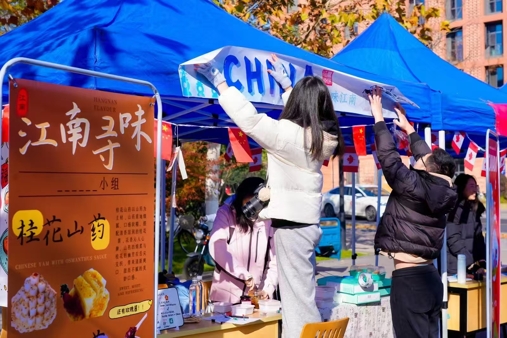
  - 
  - 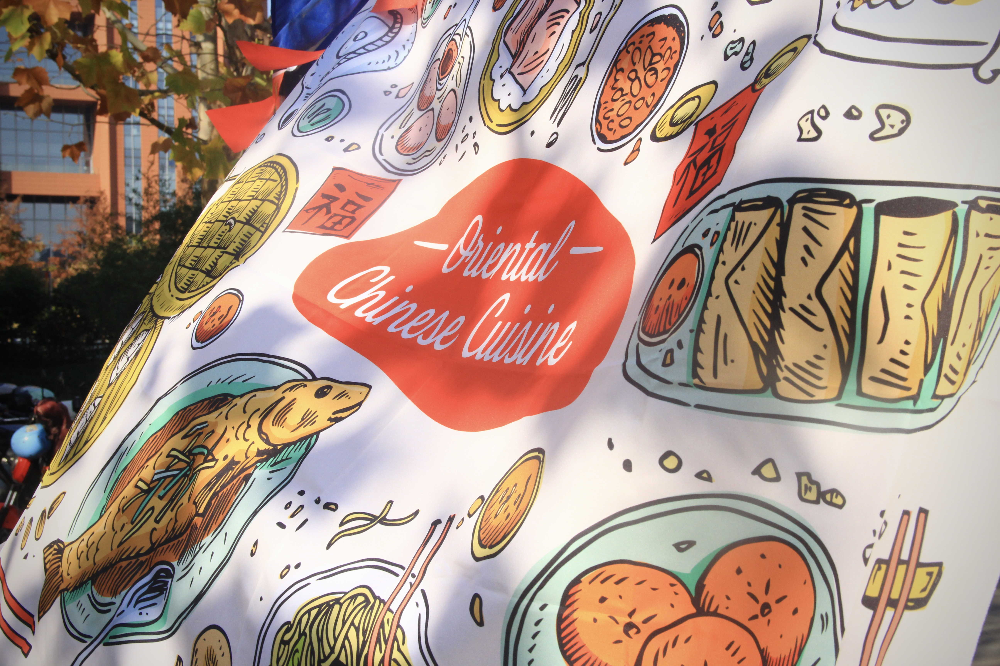
  - 

### Our Bustling Stall

  - 
  - 
  - 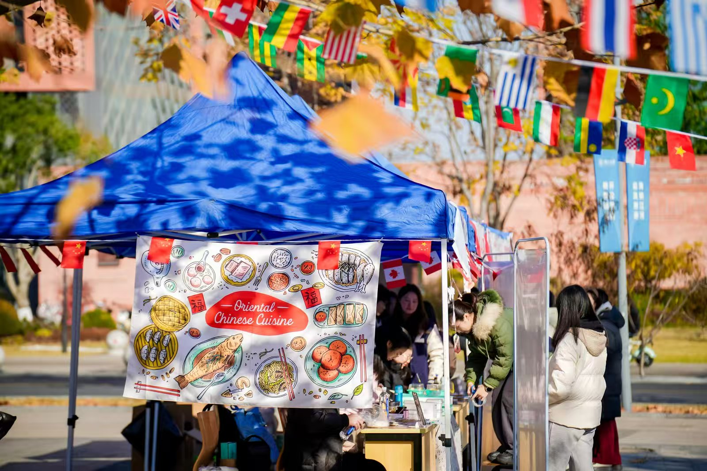
  - 
  - 
  - 

## Goals

Through this event we hope to progress in:

-   :mag:{ .abc } __Linguistic Research__

    ---

    Collecting first-hand linguistic information of the Chinese taste expressions adopted by international students

-   :shallow_pan_of_food:{ .lg .middle } __Food Exploration__

    ---

    Promoting international student-friendly Chinese dish like the Creamy Yam

-   :love_letter:{ .lg .middle } __Cultural Exchange__

    ---

    Introducing Chinese food culture via the historical heritage of Nan Song Hu Ji

## Our Unique Cuisine

-   __Creamy Yam(1) in 3 different flavors:__
    { .annotate }

    1. Yam(Chinese: 山药/Shānyào): A starchy tuber similar to sweet potato, but stickier when cooked 

    ---

    { .float-left }

      - Sugary osmanthus(1) flower sauce (Made by ourselves⸜(｡˃ ᵕ ˂ )⸝♡!!!)
      [:octicons-arrow-right-24: See Our Creation Here](Event Snapshots.md/#osmanthus-sugar) 
      { .annotate }
    
        1. Osmanthus(Chinese: 桂花/Guìhuā):Fragrant flowers symbolizing prosperity, often candied for desserts
      
      - Blueberry sauce
      - Rose petal sauce (Quite amazing huh?( • ᴗ - ) ✧)
      
    [Come to Our Recipe](Event Snapshots.md/#our-recipe){ .md-button }

-   __Nan Song Hu Ji:__

    ---

    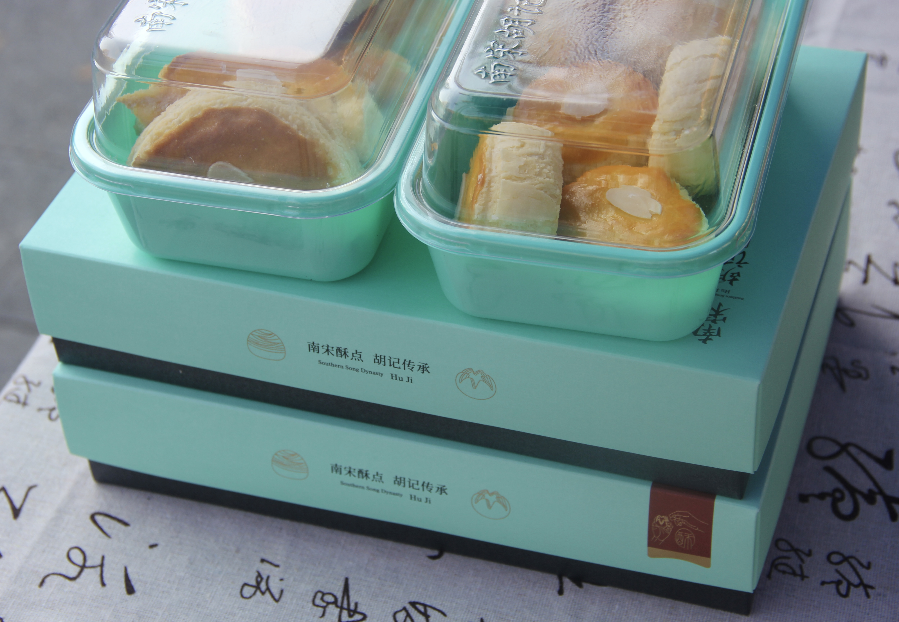{ .float-right }
    

    Hu's confectionery of the Southern Song Dynasty(Chinese: 南宋胡记/Nán Sòng Hú Jì)
    
    
    
    A Hangzhou pastry brand reviving 12th-century recipes with modern twists

### WHY These Cuisines?

-   :earth_asia: __Transcending Eras & Cultures__

    ---

    • **Quintessential Chinese Ingredients**
    
    - Chinese yam: A staple in Traditional Chinese Medicine cuisine
    - Osmanthus sugar: A Hangzhou heritage ingredient dating to Southern Song Dynasty
    - Rose petal jam: Yunnan's floral terroir expression
    
    • **Western Accents**
    
    - Condensed milk & cream: Spellbinding culinary integration
    - Chinese motifs mingled with European techniques(Cake piping originally decided)
    - Mint garnish: Modern gastronomic plating aesthetics

-   :fontawesome-solid-seedling:{ .lg .middle } __Cultural Signature__

    ---

    
    
    **• Southern Song Dynasty Revival**
    
    - *Nan Song Hu Ji* pastries resurrect 12th-century imperial recipes, like edible time capsules from Hangzhou’s golden age. Their "West Lake Snow Cake" mirrors the poetic scenery that inspired Song dynasty painters.
    
    **• Osmanthus’ Cultural Code**
    The osmanthus in our desserts isn’t just flavor – it’s a **living symbol**. In China:
    
    - Blooms during the Mid-Autumn Festival (family reunion season)
    - Ancient scholars wrote poems about its apricot-like fragrance
    - Used in **wedding desserts** as a prosperity charm
    
    **• Medicinal Wisdom Meets Modern Palates**
    Chinese yam (*shānyào*):
    
    - Called "the people’s ginseng" in Traditional Chinese Medicine for digestive benefits
    - Its sticky texture represents **longevity** in food symbolism
    - Possessing great cross-cultural appeal along with sugary osmanthus,blueberry & rosepetal sauces
    
    

-   :man_cook:{ .lg .middle } __East-West Culinary Alchemy__

    • **Traditional Chinese Culinary Techniques**

    Unlike Western cooking's predominant roasting, lots of traditional Chinese dishes employ steaming to preserve *qi* (vital energy) – a Confucian "harmony" principle
    
    ???+ note
    
        Actually we used boiling as a substitution of steaming. For the reason, come to [**Kitchenantics**](Event Snapshots.md#kitchenantics).(ó﹏ò｡)
    
    • **Integrated Western Culinary Techniques**
    
    - **Condensed Milk Application**
      *French pâtisserie technique* adapted for:
        - Balancing yam’s earthy notes with sugary sweetness
        - Creating smoother texture than traditional Chinese granulated sugar coatings
    - **Light Cream Emulsification**
        Borrowed from *Italian mascarpone preparation*:
        - Stabilizes yam’s mucilage (prevents stringiness)
        - Enables piping consistency without gelatin (uncommon in classic Chinese desserts)
    
    - **Cake Piping Methods(Originally planned)**
        - Integrating Chinese flavors with French pastry techniques
    - **Mint Garnish Logic**
      *Modern gastronomy color theory*:
        - Green contrasts white-yam for visual "pop"
        - Freshens palate between bites (Western tasting menu approach)
    
    - **Temperature Control**
      Precision simmering:
        - More accurate than traditional "wu huo" (武火) flame adjustment
        - Preserves osmanthus’ volatile aromatics
    
    

-   :gift_heart:{ .lg .middle } __Interactive Experience__

    ---

    
    
    Guests will:
    
    - **Have It Your Way**: Pick the flavor you're interested in and enjoy! 
    - **Taste History**: Identify assorted flavorful pastries mirroring Song dynasty court desserts
    - **Tell Your Taste Bud's Story**: Describe the marvelous sensory experience **in Chinese**

## Our Games

-   __Tell Your Taste Buds' Story!__
    
    ---

    { .float-left }
    { .float-left }
    
    - Step1: Taste our unique cuisine
    - Step2: Describe the flavor in Chinese

    ???+ Inspiration tip
        Through the game we attained valuable information for our linguistic research, therefore we could make a difference!

        [:octicons-arrow-right-24: See Our Linguistic Research Here](Overview LE.md){ .md-button }

-   __Slimy and Slippery Thrill!__

    ---

    { .float-right }
    Try peeling the yam (Sounds easy but quite slippery on hand)!
    

    ???+ warning
        Wearing gloves is a must, for the sticky slime on peeled yams will cause an allergic reaction.
        
    
        It really iiiiiiiiiiiiiiiiiitches!!!

- {  width=300 }

- 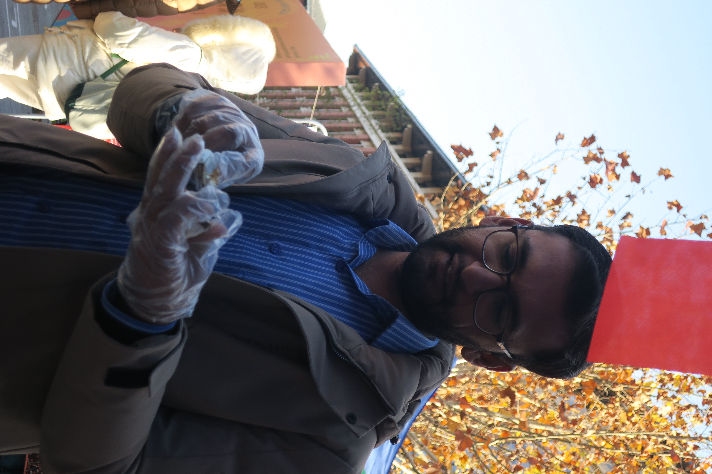{  width=300 }

- {  width=300 }

## Our Recipe(,,>ヮ<,,)

### Kitchen Shots! :camera_with_flash:

### Creamy Yam

-   Creamy Yam **MADE BY OURSELVES!**
    

    ---

    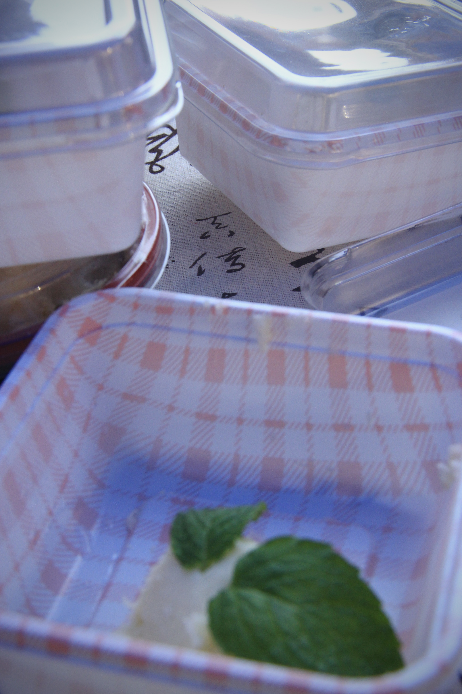{ .float-left }

    ???+ note
        Merged with sugar and milk, the unique aroma yam offers you an unparalled silky favor mingled with sweetness.
    
      

#### Ingredients

- 1 kg mealy yam (preferably iron-stick yam)
- 1 tbsp white vinegar (for soaking)
- **Coating**: Generous amount of white sugar
- 60g condensed milk
- 65g light cream

???+ caution
    Note that excessive light cream will make the yam too thin to shape 

#### Steps

1. **Prep the Yam**

    * Wear gloves

    ???+ warning
        Sticky slime on peeled yams will cause an allergic reaction.
        
        It really iiiiiiiiiiiiiiiiiitches!!!

    * Peel and soak in vinegar water (1 tbsp white vinegar + water) for 10 mins to **prevent oxidation** (browning).

     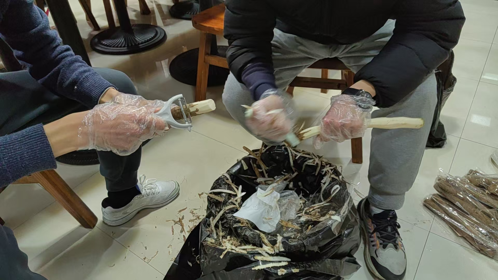

2. **Clean & Cut**

    - Scrub yam segments in vinegar water until **smooth and white** (removes allergens).
    - Cut into chunks, place on a heatproof plate, and **liberally coat with sugar**.

3. **Steam**

    - Steam for 30 mins over high heat. Sugar will melt into syrup.

4. **Blend** (*Critical texture steps*)

    - Transfer yam + syrup to a blender. Add condensed milk and cream.
    - **Blend for 10-20 secs max** (*over-blending makes paste too thin*).
    - **No water added** – relies on natural moisture offered by the syrup.

    ???+ Alternatives tip
        - Hand-mashing: For grainier texture (traditional approach).
        - No dairy: Lighter, herbal flavor but less aromatic.

5. **Pipe & Serve**

    - Sieve paste if lumpy (*prevents clogging piping tip*).

    - Shape the paste onto plates or other containers.

​    
    

    
    -   __Piping Scenes__
    
        ---
    
        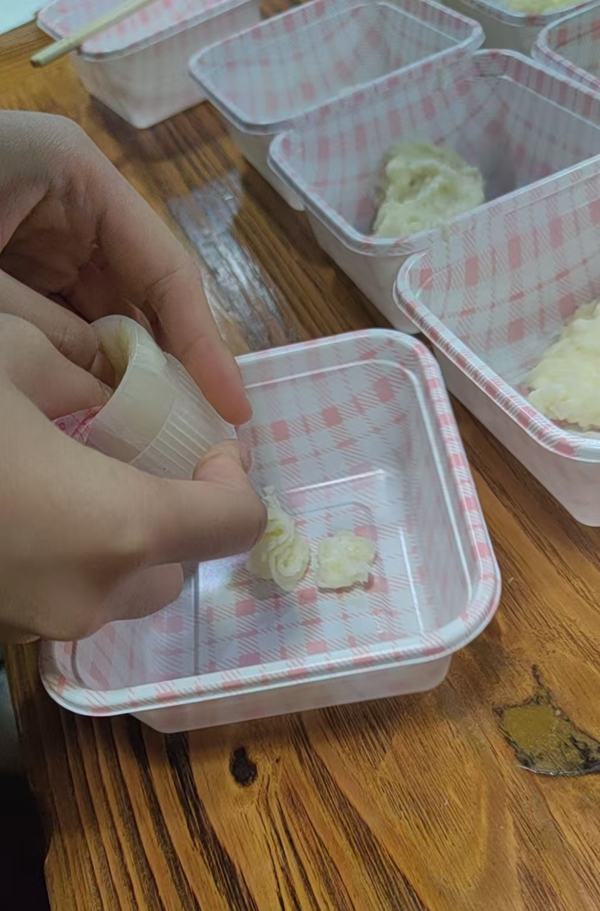{ .float-left-1 }
        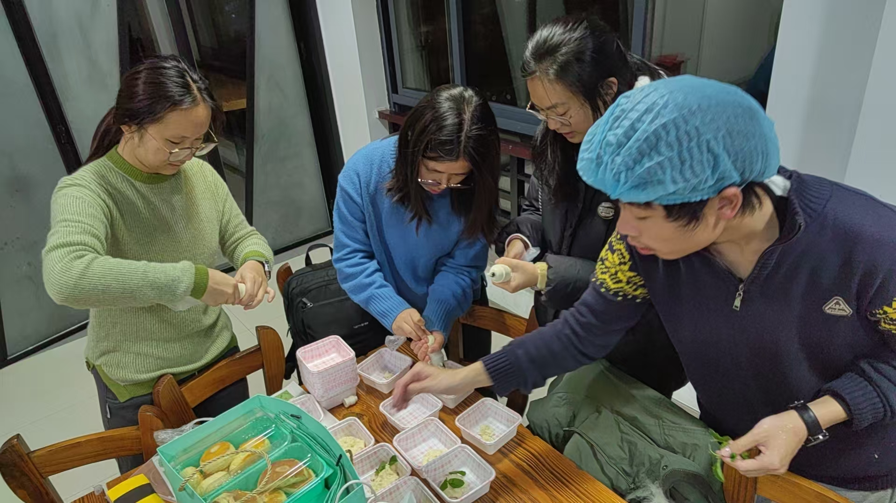{ .float-right }
    
        ???+ question "Pity"
            We initially planned to make delicate decorations with a piping bag, but it's a pity that such a step is only partially implemented due to time constraints (◞‸ ◟)💧
    
    

    
    - Garnish with mint leaves
    
    - Top with the **sauce** and enjoyദ്ദി(˵ •̀ ᴗ - ˵ ) ✧.

### Osmanthus Sugar

-   Osmanthus Sugar **MADE BY OURSELVES!**
    

    ---

    { .float-left }

    ???+ note
        Consisting of water, sugar and osmanthus flowers, Osmanthus Sugar clearly distinguishes from Osmanthus Honey Blends
    
      

#### Ingredients & Tools

- 300g white granulated sugar
- 150g water *(measured precisely)*
- 20g dried osmanthus flowers *(tea-grade preferred)*
- 30g lemon juice *(≈½ lemon, strained)*
- 1g salt *(**anti-crystallization** agent)*
- Heavy-bottomed saucepan *(essential for even heating)*

#### Steps

1. **Flower Prep**

    - Rinse (if using fresh) → Sun-dry until crisp
    - *or* Use pre-dried tea-grade osmanthus *(no washing needed)*

2. **Sugar Syrup Base**

    - Combine sugar + water → **High heat** until boiling
    - Reduce to **low simmer** (6 mins)
    - 🔥 **Critical**: Water ratio must be exact!
      ???+ tip
        Better under- than over-hydrated – easily adjusted later

3. **Floral Infusion**

    - Add osmanthus + lemon juice + salt → **Return to boil**

     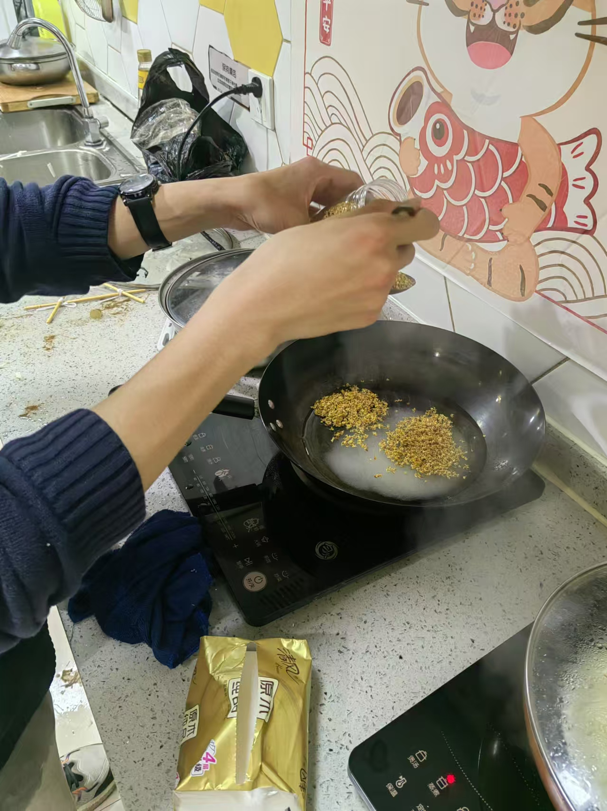

    ???+ Mishap
        Actually from the photo you can find that due to time constraints, our chef inadvertently reversed the sequence, adding osmanthus flowers immediately after sugar - yet serendipitously, the dish retained its aromatic integrity.( ⸝⸝´꒳`⸝⸝)

    - Simmer 4 mins *(set timer!)*

    - 🍋 Pro Tip: Strain lemon seeds to avoid bitterness

## Kitchenantics

On our trial (weeks before the event) we used a steamer, which created ideal Creamy Yam smoothly. 

BUT, on the real run we find the kitchen **WITHOUT A SUITABLE STEAMER**!!!( ꩜ ᯅ ꩜;) 

We tried using microwave oven, but it's a little challenging for us to control the heat, as evidenced by the culinary disaster below...

  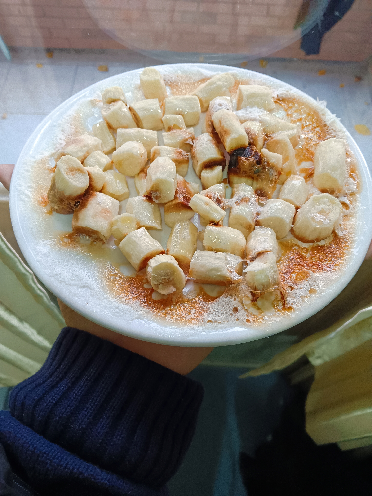

  The white sugar caramelized upon heating – expanding with vigorous bubbling as pyrolysis occurred, releasing aromatic compounds and developing a rich amber hue through the Maillard reaction.

??? note "(っ'ヮ'c)"
    ~~Wow, mouthwatering caramel!~~

  The yam and sugar are tightly bonded together, forming a hard...hmm...statue? We tried placing the plate upside down, and the dish remain still and didn't fall...

  Luckily, we managed to find substitutional methods for steaming like boiling, and thus successfully finished the thrilling cooking.

???+ tip "( ≧ᗜ≦)" 
    The hilarious part? We take the kitchen catastrophe on the event, and multiple people actually eyed that culinary trainwreck with interest and asked for a taste(˶°ㅁ°)!!

  Speaking of which, presently the statue is still kept as a memorial by one of our group member. It remains intact so far as months have passed...

## Offstage Stories

Our Great Efforts

我们团队为本次活动投入了许多努力和心思，只为让我们的外国朋友更好地体会我们的特色美食！

我们的努力包括：

### 食材调研

为了达到想要的软绵口感，我们选取铁棍山药作为奶油山药泥的主要原料。为了保证在活动前能够有足够的山药原料，我们的主厨考察了校园周边的菜市场

### 提前试验

奶油山药泥的新奇对我们而言也有着巨大的吸引力！我们的主厨先在自己家中尝试了一次，并用蒸锅取得了非常好的成果！

然后，我们的主厨用wok制作了糖桂花。这次试验中，他没有控制好白砂糖和水的比例，加入了过多的水，只能在中途又加入大量白砂糖作为补救。这次失误为我们团队提供了宝贵的经验，使得我们在活动前夜的制作中严格限制了制作糖桂花时加的水量

### 厨房考察

预约校园毕至居厨房后，我们的主厨提前一周考察了厨房的配置。结合自己在家里试验的经历，他确认这个厨房有基本的厨具、冰箱、微波炉、烤箱、电磁炉、电饭煲，由此对活动前的烹饪更加有了信心。

### 器具配置

### 其他巧思

### 活动前夜

活动前一天晚上，我们在毕至居进行了奶油山药泥以及糖桂花的制作

遗憾的是，我们主厨没有仔细确认该厨房的器皿是否适配我们将要进行的烹饪操作。在活动前夜，尽管他已经尽可能地考虑到厨房情况，从家里带了蒸屉，并且买了金属三脚蒸架，但是在实际操作时遇到了困难：

家里带来的蒸屉太大，无法放入这个厨房的电饭煲；买的金属蒸架太高，无法放入电磁炉并盖上锅盖。

这样以来，我们烹饪过程中最重要的蒸这一步就遇到了巨大的挑战。

为此，我们团队的成员没有泄气，而是积极地寻求解决方法。

我们用一次性筷子搭建高度合适的简易蒸架以放进电磁炉；我们尝试用烤箱、微波炉烘烤，用电饭煲水煮这些方法替代蒸的操作……

在我们的努力下，我们成功克服了客观条件上的困难，得到了预期的软绵山药口感。

当我们结束一晚上紧张忙碌的烹饪工作，对厨房进行打扫和整理时，我们团队都感到无与伦比的喜悦和满足！

