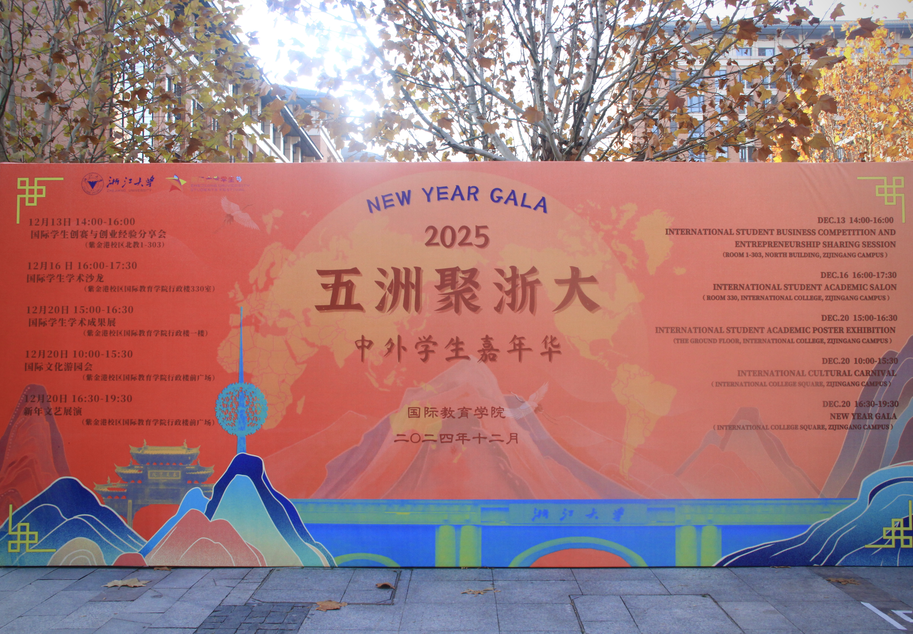
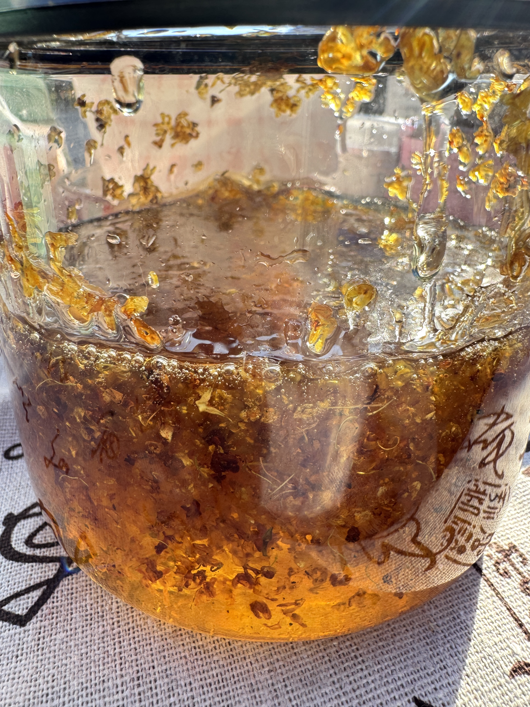
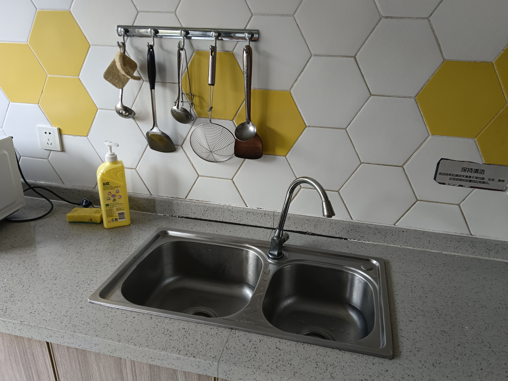
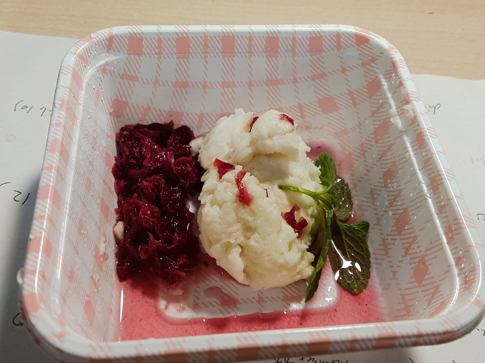
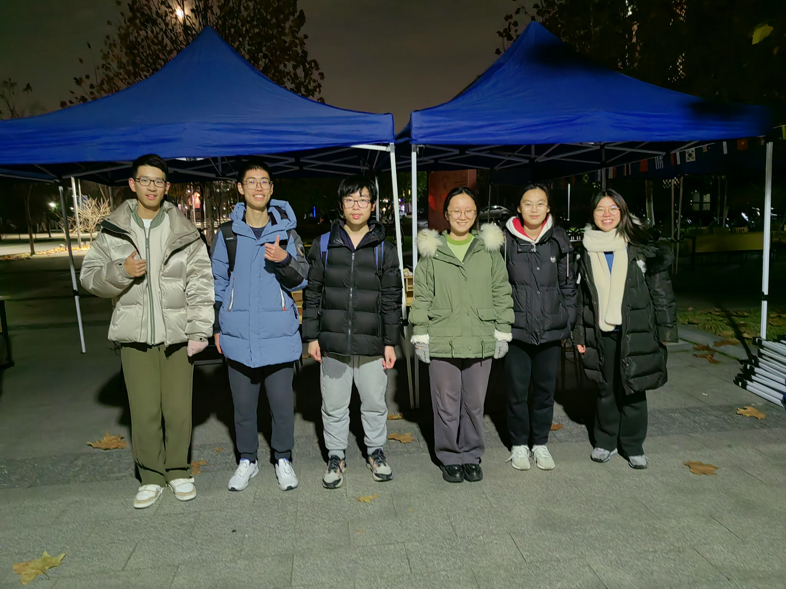

# Jiangnan Flavour

## Inspiration

We discovered these problems faced by international students when adapting to Chinese food:

- :tongue:Unfamiliar with Chinese food texture vocabulary

- :cooking:Unfamiliar with Chinese culinary cooking techniques

- :cold_sweat:Facing difficulty in articulating meal order in Chinese

Therefore, on Dec 20th, 2025, we take an active part in the New Year Gala organized by ISU.

## Event Silhouettes
<!-- 
hello
 -->

"Where laughter, aromas and cheers collide"

### Intense Preparation

  - 
  - 
  - 
  - 
  - 

### Our Bustling Stall

  - 
  - 
  - 
  - 
  - 
  - 

## Goals

Through this event we hope to progress in:

-   :mag:{ .abc } __Linguistic Research__

    ---

    Collecting first-hand linguistic information of the Chinese taste expressions adopted by international students

-   :shallow_pan_of_food:{ .lg .middle } __Food Exploration__

    ---

    Promoting international student-friendly Chinese dish like the Creamy Yam

-   :love_letter:{ .lg .middle } __Cultural Exchange__

    ---

    Introducing Chinese food culture via the historical heritage of Nan Song Hu Ji

## Our Unique Cuisine

-   __Creamy Yam(1) in 3 different flavors:__
    { .annotate }

    1. Yam(Chinese: 山药/Shānyào): A starchy tuber similar to sweet potato, but stickier when cooked 

    ---

    { .float-left }

      - Sugary osmanthus(1) flower sauce (Made by ourselves⸜(｡˃ ᵕ ˂ )⸝♡!!!)
      [:octicons-arrow-right-24: See Our Creation Here](Event Snapshots.md/#osmanthus-sugar) 
      { .annotate }
    
        1. Osmanthus(Chinese: 桂花/Guìhuā):Fragrant flowers symbolizing prosperity, often candied for desserts
      
      - Blueberry sauce
      - Rose petal sauce (Quite amazing huh?( • ᴗ - ) ✧)
      
    [Come to Our Recipe](Event Snapshots.md/#our-recipe){ .md-button }

-   **Sugary Osmanthus**

    ---
    
    (*online picture for reference*)

-   **Rose Petal Sauce**

    ---
    
    (*online picture for reference*)

-   __Nan Song Hu Ji:__

    ---

    { .float-right }
    

    Hu's confectionery of the Southern Song Dynasty(Chinese: 南宋胡记/Nán Sòng Hú Jì)
    
    
    
    A Hangzhou pastry brand reviving 12th-century recipes with modern twists!

    Each bite carries 800 years of Hangzhou heritage! 🥄💫

​	

### WHY These Cuisines?

-   :earth_asia: __Transcending Eras & Cultures__

    ---

    • **Quintessential Chinese Ingredients**
    
    - Chinese yam: A staple in Traditional Chinese Medicine cuisine
    - Osmanthus sugar: A Hangzhou heritage ingredient dating to Southern Song Dynasty
    - Rose petal jam: Yunnan's floral terroir expression
    
    • **Western Accents**
    
    - Condensed milk & cream: Spellbinding culinary integration
    - Chinese motifs mingled with European techniques(Cake piping originally decided)
    - Mint garnish: Modern gastronomic plating aesthetics

-   :fontawesome-solid-seedling:{ .lg .middle } __Cultural Signature__

    ---

    
    
    **• Southern Song Dynasty Revival**
    
    - *Nan Song Hu Ji* pastries resurrect 12th-century imperial recipes, like edible time capsules from Hangzhou’s golden age. Their "West Lake Snow Cake" mirrors the poetic scenery that inspired Song dynasty painters.
    
    **• Osmanthus’ Cultural Code**
    The osmanthus in our desserts isn’t just flavor – it’s a **living symbol**. In China:
    
    - Blooms during the Mid-Autumn Festival (family reunion season)
    - Ancient scholars wrote poems about its apricot-like fragrance
    - Used in **wedding desserts** as a prosperity charm
    
    **• Medicinal Wisdom Meets Modern Palates**
    Chinese yam (*shānyào*):
    
    - Called "the people’s ginseng" in Traditional Chinese Medicine for digestive benefits
    - Its sticky texture represents **longevity** in food symbolism
    - Possessing great cross-cultural appeal along with sugary osmanthus,blueberry & rosepetal sauces
    
    

-   :man_cook:{ .lg .middle } __East-West Culinary Alchemy__

    • **Traditional Chinese Culinary Techniques**

    Unlike Western cooking's predominant roasting, lots of traditional Chinese dishes employ steaming to preserve *qi* (vital energy) – a Confucian "harmony" principle
    
    ???+ note
    
        Actually we used boiling as a substitution of steaming. For the reason, come to [**Kitchenantics**](Event Snapshots.md#kitchenantics).(ó﹏ò｡)
    
    • **Integrated Western Culinary Techniques**
    
    - **Condensed Milk Application**
      *French pâtisserie technique* adapted for:
        - Balancing yam’s earthy notes with sugary sweetness
        - Creating smoother texture than traditional Chinese granulated sugar coatings
    - **Light Cream Emulsification**
        Borrowed from *Italian mascarpone preparation*:
        - Stabilizes yam’s mucilage (prevents stringiness)
        - Enables piping consistency without gelatin (uncommon in classic Chinese desserts)
    
    - **Cake Piping Methods(Originally planned)**
        - Integrating Chinese flavors with French pastry techniques
    - **Mint Garnish Logic**
      *Modern gastronomy color theory*:
        - Green contrasts white-yam for visual "pop"
        - Freshens palate between bites (Western tasting menu approach)
    
    - **Temperature Control**
      Precision simmering:
        - More accurate than traditional "wu huo" (武火) flame adjustment
        - Preserves osmanthus’ volatile aromatics
    
    

-   :gift_heart:{ .lg .middle } __Interactive Experience__

    ---

    
    
    Guests will:
    
    - **Have It Your Way**: Pick the flavor you're interested in and enjoy! 
    - **Taste History**: Identify assorted flavorful pastries mirroring Song dynasty court desserts
    - **Tell Your Taste Bud's Story**: Describe the marvelous sensory experience **in Chinese**

## Our Games

-   __Tell Your Taste Buds' Story!__
    
    ---

    { .float-left }
    { .float-left }
    
    - Step1: Taste our unique cuisine
    - Step2: Describe the flavor in Chinese

    ???+ Inspiration tip
        Through the game we attained valuable information for our linguistic research, therefore we could make a difference!

        [:octicons-arrow-right-24: See Our Linguistic Research Here](Overview LE.md){ .md-button }

-   __Slimy and Slippery Thrill!__

    ---

    { .float-right }
    Try peeling the yam (Sounds easy but quite slippery on hand)!
    

    ???+ warning
        Wearing gloves is a must, for the sticky slime on peeled yams will cause an allergic reaction.
        
    
        It really iiiiiiiiiiiiiiiiiitches!!!

- {  width=300 }

- {  width=300 }

- {  width=300 }

## Our Recipe(,,>ヮ<,,)

### Kitchen Shots! :camera_with_flash:

### Creamy Yam

-   Creamy Yam **MADE BY OURSELVES!**
    

    ---

    { .float-left }

    ???+ note
        Merged with sugar and milk, the unique aroma yam offers you an unparalled silky favor mingled with sweetness.
    
      

#### Ingredients

- 1 kg mealy yam (preferably iron-stick yam)
- 1 tbsp white vinegar (for soaking)
- **Coating**: Generous amount of white sugar
- 60g condensed milk
- 65g light cream

???+ caution
    Note that excessive light cream will make the yam too thin to shape 

#### Steps

1. **Prep the Yam**

    * Wear gloves

    ???+ warning
        Sticky slime on peeled yams will cause an allergic reaction.
        
        It really iiiiiiiiiiiiiiiiiitches!!!

    * Peel and soak in vinegar water (1 tbsp white vinegar + water) for 10 mins to **prevent oxidation** (browning).

     

2. **Clean & Cut**

    - Scrub yam segments in vinegar water until **smooth and white** (removes allergens).
    - Cut into chunks, place on a heatproof plate, and **liberally coat with sugar**.

3. **Steam**

    - Steam for 30 mins over high heat. Sugar will melt into syrup.

4. **Blend** (*Critical texture steps*)

    - Transfer yam + syrup to a blender. Add condensed milk and cream.
    - **Blend for 10-20 secs max** (*over-blending makes paste too thin*).
    - **No water added** – relies on natural moisture offered by the syrup.

    ???+ Alternatives tip
        - Hand-mashing: For grainier texture (traditional approach).
        - No dairy: Lighter, herbal flavor but less aromatic.

5. **Pipe & Serve**

    - Sieve paste if lumpy (*prevents clogging piping tip*).

    - Shape the paste onto plates or other containers.

    - Garnish with mint leaves
    
    - Top with the **sauce** and enjoyദ്ദി(˵ •̀ ᴗ - ˵ ) ✧.

​
 

-   __Piping Scenes__

    ---
    
    { .float-left-1 }
    { .float-right }
    
    ???+ question "Pity"
        We initially planned to make delicate decorations with a piping bag, but it's a pity that such a step is only partially implemented due to time constraints (◞‸ ◟)💧

    
    
    

### Osmanthus Sugar

-   Osmanthus Sugar **MADE BY OURSELVES!**
    

    ---

    { .float-left }

    ???+ note
        Consisting of water, sugar and osmanthus flowers, Osmanthus Sugar clearly distinguishes from Osmanthus Honey Blends
    
      

#### Ingredients & Tools

- 300g white granulated sugar
- 150g water *(measured precisely)*
- 20g dried osmanthus flowers *(tea-grade preferred)*
- 30g lemon juice *(≈½ lemon, strained)*
- 1g salt *(**anti-crystallization** agent)*
- Heavy-bottomed saucepan *(essential for even heating)*

#### Steps

1. **Flower Prep**

    - Rinse (if using fresh) → Sun-dry until crisp
    - *or* Use pre-dried tea-grade osmanthus *(no washing needed)*

2. **Sugar Syrup Base**

    - Combine sugar + water → **High heat** until boiling
    - Reduce to **low simmer** (6 mins)
    - 🔥 **Critical**: Water ratio must be exact!
      ???+ tip
        Better under- than over-hydrated – easily adjusted later

3. **Floral Infusion**

    - Add osmanthus + lemon juice + salt → **Return to boil**

     

    ???+ Mishap
        Actually from the photo you can find that due to time constraints, our chef inadvertently reversed the sequence, adding osmanthus flowers immediately after sugar - yet serendipitously, the dish retained its aromatic integrity.( ⸝⸝´꒳`⸝⸝)

    - Simmer 4 mins *(set timer!)*

    - 🍋 Pro Tip: Strain lemon seeds to avoid bitterness

------

## Behind-the-Scenes Chronicles:pencil:

### Our Dedicated Efforts

Devoting tremendous effort and care to this event, our team poured hearts into it to deliver authentic Chinese culinary magic for our international friends! (ﾉ◕ヮ◕)ﾉ*:･ﾟ✧

Our preparations included:

------

### Ingredient Quest

To achieve the **ultimate velvety texture**, we sourced **iron-stick yams** (*Dioscorea opposita*) – the MVP of Traditional Chinese Medicine cuisine!

To ensure sufficient ingredients before the event, our chef scanned 3 **campus-area markets** for price/quality comparisons 📊

  - 
  - 
  - 
  - 

Finally we sourced premium fresh iron-stick yams via **Dingdong Maicai** app mainly.

------

### Trial Runs

#### 1. Creamy Yam Prototype

The novelty of creamy yam paste greatly intrigued us! Our chef implemented preliminary trials at home using a steamer, achieving excellent results. 

  - 
  - 

  - 
  - 
  - 

  - 
  - 
  - 
  - 

In his "kitchen lab" our chef:

- Perfected steaming with a **Steaming drawer**
- Discovered **adequate rate** to reconcile yam,granulated sugar, condensed milk & light cream

#### 2.Osmanthus Sugar Adventure
Our chef then attempted making osmanthus sugar in a wok. During this trial, he miscalculated the sugar-to-water ratio, accidentally adding too much water initially and compensating with extra sugar later(｡>﹏<). This valuable mistake taught us to strictly control water measurements during the actual preparation.

  - 
  - 

Along with the blueberry sauce and rose petal sauce made from jam with honey water

  - 
  - 

**WE'VE GOT:**

-   **Mouthwatering Trial Results!**

    ---

    

- 
- 

Lesson learned: Western pastry techniques + Chinese ingredients = :gift_heart:

------

### Kitchen Recon

After reserving the campus Bizhiju kitchen, our chef inspected its facilities one week prior. Drawing from his home trials, he confirmed the kitchen had essential cookers, refrigerator, microwave, oven, induction cooker, and rice cooker - boosting our confidence for the event.

- 
- 
- 
- 

| Equipment         | Status                                          |
| :---------------- | :---------------------------------------------- |
| Industrial fridge | ✔️ Perfect for **Culinary Creation** **Storage** |
| Rice cooker       | :question:Available for steaming?               |
| Microwave,        | :question: Alternative for steaming?            |

Pro tip: Mind to take a **compatible steamer** – ours got stuck in transit (╥﹏╥)

------

### Equipment Prep

We carefully considered the event logistics! Anticipating individual servings of yam paste, we bought pastry boxes in advance. The dainty yam paste paired perfectly with these charming checkered boxes! Combined with our use of mint leaves, we successfully created dishes that delighted not only your tongue but also your eyeballs!

- 
- 

What's more, we've also taken consideration the gloves and peelers needed for the event, and we were well prepared!ദ്ദി ˉ͈̀꒳ˉ͈́ )✧

- 
- 

### Additional Creativity

We had another unrealized idea - introducing Chinese spices! Chinese cuisine employs spices with profound depth. The "Five-Spice" flavor profile specifically combines:

1. **Star anise** – Sweet licorice vibe ✨
2. **Sichuan pepper** – Tingly "mala" buzz 🌶️
3. **Cassia bark** – Warm cinnamon hug 🪵
4. **Cloves** – Powerful floral punch 🌺
5. **Fennel seeds** – Gentle herbal whisper 🍃

We originally planned an interactive game - identifying these spices and describing their flavors! Though unfulfilled, we highly recommend exploring the richness of Chinese spices! (˶˃ ᵕ ˂˶) .ᐟ.ᐟ

- 
- 

*Next time, friends!* ヽ(✿ﾟ▽ﾟ)ノ

------

### Night Before the Event

On the night before, we prepared the creamy yam paste and osmanthus sugar at Bizhiju kitchen.

Regrettably, our chef hadn't thoroughly verified the kitchenware compatibility. Despite bringing a steamer from home and purchasing a metal trivet for steaming use, we encountered difficulties:

- The steamer was too large for the kitchen rice cooker
- The trivet was too tall for the induction cooker with lid

This posed significant challenges for the crucial steaming process (,,>ࡇ<,,)( Details in [:material-arrow-right:Kitchenantics](#kitchenantics)).

Undeterred, our team proactively sought solutions:

- Built an improvised steamer using disposable chopsticks:bulb:
- Experimented with alternative methods: oven baking, microwaving, and boiling in the rice cooker

Through perseverance, we overcame these obstacles and achieved the desired fluffy yam texture.

As we concluded the night's intense cooking session and cleaned the kitchen, our entire team felt incomparable joy and satisfaction!(♡ˊ͈ ꒳ ˋ͈)

<figure markdown="span">
  
  <figcaption>Team Members Invovled in Our Kitchen Triumph!</figcaption>
</figure>

------

### Why This Matters

Through kitchen wars and joint dedication, our team grew distinctly cohesive, as our efforts served as a very testimony to the idea below:

:star2:Great cuisines bridges cultures faster than any translator!

## Kitchenantics

On our trial (weeks before the event) we used a steamer, which created ideal Creamy Yam smoothly. 

BUT, on the real run we find the kitchen **WITHOUT A SUITABLE STEAMER**!!!( ꩜ ᯅ ꩜;)

We tried using microwave oven, but it's a little challenging for us to control the heat, as evidenced by the culinary disaster below...

  

  The white sugar caramelized upon heating – expanding with vigorous bubbling as pyrolysis occurred, releasing aromatic compounds and developing a rich amber hue through the Maillard reaction.

??? note "(っ'ヮ'c)"
    ~~Wow, mouthwatering caramel!~~

  The yam and sugar are tightly bonded together, forming a hard...hmm...**statue**? We tried placing the plate upside down, and the dish remain still and DIDN'T FALL...

  Luckily, we managed to find substitutional methods for steaming like boiling, and thus successfully finished the thrilling cooking.

???+ tip "( ≧ᗜ≦)" 
    The hilarious part? We take the kitchen catastrophe on the event, and multiple people actually eyed that culinary trainwreck with interest and asked for a taste(˶°ㅁ°)!!

  Speaking of which, presently the **statue** is still kept as a memorial by one of our group member. It **REMAINS INTACT** so far as months have passed...

