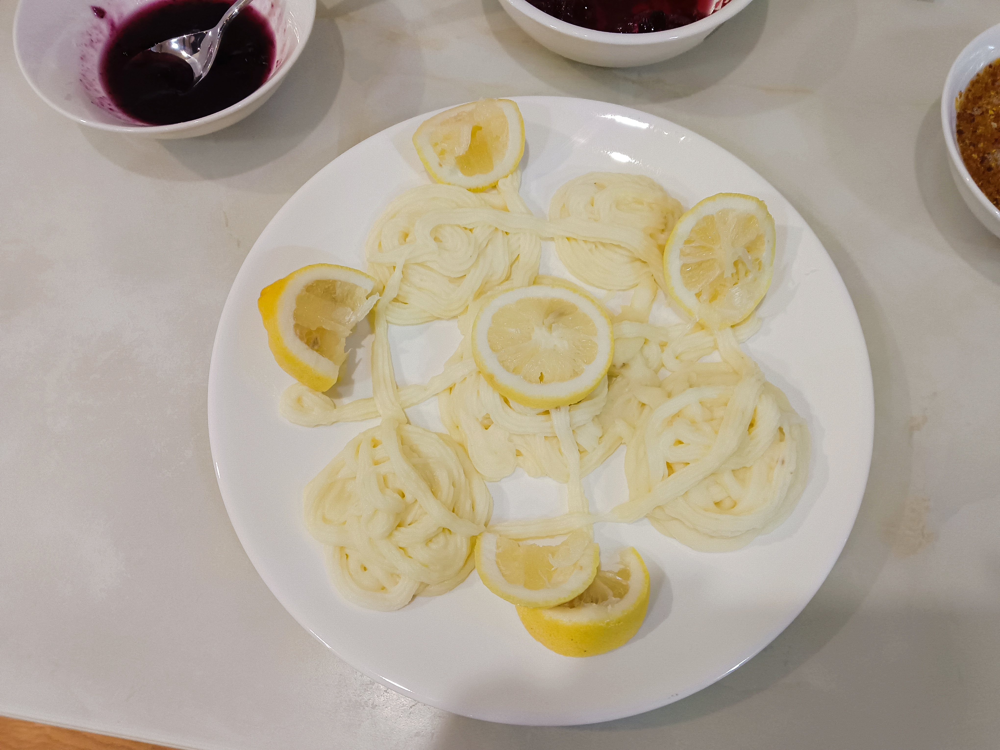

# **Jiangnan Flavour** 🌟

## Inspiration 🪄

As highlighted on our [Home Page](index.md), our research uncovered several major hurdles international students face when navigating Chinese cuisine:

- :tongue:Unfamiliar with **Chinese food texture vocabulary**

- :cooking:Unfamiliar with **Chinese culinary cooking techniques**

- :cold_sweat:Facing difficulty in articulating **meal order in Chinese**

On December 20, 2025, we brought our solution to life at **ISU**'s flagship multicultural event- **==New Year Gala==**! ✨

## Event Silhouettes 📸
<!-- 
hello
 -->

Where laughter, aromas and cheers collide 🌍🤝

### Energetic Preparation ✨

  - 

  - 
  - 
  - 
  - 
  

???+ tip "A Cultural Feast in Full Swing! 🌞"
    As the morning sun bathed our campus in golden light, our team’s early shift sprang into action—full of energy and excitement! ✨ We set up our vibrant food stall, adorned it with elegant Chinese-inspired decorations, and carefully displayed our distinctive delicacies(some of which **HANDCRAFTED!**) and interactive games. 
    
    > Details in [ → Our Unique Cuisine](#our-unique-cuisine) & [ → Our Games](#our-games)

    

    The air buzzed with anticipation—the joy of sharing food, the thrill of cultural exchange, and the excitement of connecting with international friends! 🔥 Our team radiated passion, ready to make this big day unforgettable.

### Our Bustling Stall 🎊

  - 
  - 
  - 
  - 
  - 
  - 

???+ tip "A Non-Stop Flow of Smiles & Flavors! 🎉"
    The event was a **ROARING SUCCESS**—our stall saw an endless stream of visitors all day long! The Creamy Yam Purée and Nan Song Hu Ji pastries were such a **HIT** that they were being delivered out quickly, forcing our afternoon shift to introduce a mini-game(peeling yam) to manage the overwhelming demand!😆

    Meanwhile, our team members explored other stalls, savoring global flavors and joining in the festivities—truly immersing ourselves in the joyous, multicultural spirit of the New Year Gala! 🌍🍜

### A Fitting Finale to a Perfect Day 🎉
???+ tip "(♡ˊ͈ ꒳ ˋ͈)"
    As the event wrapped up, our hearts swelled with pride and happiness. On this bright winter day, food and laughter became the universal language—bringing cultures together in a symphony of flavors and friendship! 🎊

📸 Team Photo Moment!
<figure markdown="span">
  
  <figcaption>Our Afternoon Shift(all gratified after an amazing day!💖)</figcaption>
</figure>

## Goals 🎯 

Through this event we hope to progress in:

-   :mag:{ .abc } __Linguistic Research__

    ---

    Collecting first-hand ==**linguistic information**== of the Chinese taste expressions adopted by international students

-   :shallow_pan_of_food:{ .lg .middle } __Food Exploration__

    ---

    Promoting ==international student-friendly Chinese dish== like the **Creamy Yam Purée**

-   :love_letter:{ .lg .middle } __Cultural Exchange__

    ---

    Introducing ==Chinese food culture== via the historical heritage of **Nan Song Hu Ji**

## Our Unique Cuisine 🍰

-   __==HANDMADE== Creamy Yam(1) Purée in 3 different flavors:__
    { .annotate }

    1. Yam(Chinese: 山药/Shānyào): A starchy tuber similar to sweet potato, but stickier when cooked 

    ---

    { .float-left }

      - 🏵️ ==**HANDMADE**== Sugary Osmanthus(1) Flower Sauce (Made by ourselves⸜(｡˃ ᵕ ˂ )⸝♡!!!)
      [:octicons-arrow-right-24: See Our Creation Here](Event Snapshots.md/#osmanthus-sugar) 
      { .annotate }
    
        1. Osmanthus(Chinese: 桂花/Guìhuā):Fragrant flowers symbolizing prosperity, often candied for desserts
      
      - 🫐 Blueberry Sauce
      - 🌹 Rose Petal Sauce (Quite amazing huh?( • ᴗ - ) ✧)
      

!!! tip "🌟Creamy Yam Purée & Sauces"
    As a modern Chinese dessert (often served as "Blueberry Yam"), this creamy yam purée stands out as a uniquely characteristic dish! This exquisite creation is crafted from traditional Chinese yam (a signature ingredient in Chinese cuisine), white granulated sugar, condensed milk, and fresh light cream, boasting a velvety smooth texture that perfectly suits foreign friends' palates!

    > Like mashed potatoes' cool cousin! (≧▽≦)

    When paired with authentically Chinese condiments like sugary osmanthus and rose petal sauce, it becomes an ideal medium for cultural exchange with international friends!✨

    The delicate natural sweetness of Chinese yam harmonized perfectly with the luxurious creaminess of fresh dairy, creating a base that sang on the palate. This foundation became a canvas for our trio of vibrant toppings:

    

    -   
🫐

    
        ---

        Blueberry Sauce infused with juicy tartness

    -   
🏵️

        ---

        Aromatic osmanthus offering honeyed floral notes

    -   
🌹

        ---

        Romantic rose petals contributing a perfumed elegance

    

    

    

    

    For the detailed cooking process, come to our **Recipe** Here👉
    [==✨Our Recipe==](Event Snapshots.md/#our-recipe){ .md-button }

-   **Sugary Osmanthus**

    ---
    
    (*online picture for reference*)

-   **Rose Petal Sauce**

    ---
    
    (*online picture for reference*)

!!! tip "🌟Sugary Osmanthus: Hangzhou's Floral Signature"
    Ready to taste autumn in a jar? (❀❛ ֊ ❛„)♡

    Experience the sunshine-sweet magic of Sugary Osmanthus—a fragrant jewel of Hangzhou’s culinary heritage, where autumn blossoms meet Jiangnan elegance in every drop!

    Available in traditional ceramic jars or modern drip bottles—both Instagram-worthy, sugary osmanthus surely delivered a symphony of senses:

    

    -   🌺 **Scent**
    
        ---

        Intoxicating apricot-honey aroma

    -   🍬 **Taste**

        ---

        Floral sweetness

    -   ✨ **Sight**

        ---

        Glowing amber hue—like bottled sunset over West Lake 🌅

    

    More tellingly, it served as the best lens showing you the Hangzhou Touch and Jiangnan Romance!
    This isn’t just syrup—it’s edible culture:

    

    -   🏞️ **Jiangnan Elegance**
    
        ---
        The osmanthus flowers, carefully picked and processed, retain their natural beauty and delicate aroma, reminiscent of the gentle and elegant scenery of Jiangnan. They are often paired with Hangzhou's other treasures such as Longjing tea and Lotus root starch.

    -   🌕 **Family Bonds**

        ---

        Osmanthus flowers usually bloom in clusters, with numerous small flowers closely gathered together. This clustered growth pattern is seen as a metaphor for family members gathering and living in harmony. Also, they are usually harvested during Mid-Autumn Festival when osmanthus blooms coincide with the fullest moon.

    -   🍀 **Prosperity & Abundance**

        ---

        Osmanthus blossoms are often golden - yellow, an auspicious color that is traditionally associated with wealth and luxury in Chinese culture. Osmanthus is often mentioned in ancient poetry and literature, and is closely related to celebrations and joyous occasions.
    

    For the detailed cooking process, come to our **Recipe** Here👉
    [==✨Our Recipe==](Event Snapshots.md/#our-recipe){ .md-button }

!!! tip "🌟Rose Petal Sauce: A Fragrant Taste of Yunnan's Heritage"

    Indulge in the sweet, floral magic of authentic Chinese rose petal sauce—a luxurious spread where fragrance, flavor, and tradition bloom together!

    The culinary use of roses in China dates back to the **Tang Dynasty**. In Yunnan(1), edible roses (such as Rosa rugosa) have long been used to make floral jams, teas, and herbal remedies.
    { .annotate }

    1. Yunnnan: A province in southwest China, celebrated as the "Kingdom of Flowers". Boasts a remarkable floral diversity due to its ideal climate and rich biodiversity. Kunming's Dounan Flower Market, the largest in Asia, cements Yunnan’s status as a floral powerhouse.

    Unlike Western rose jams (often made with fragrant but inedible roses), Chinese rose jam emphasizes naturally sweet, edible varieties with minimal added sugar, preserving the flower's delicate essence.

    Try this valuable culinary heritage and feel its charm! (˶˃ ᵕ ˂˶)

    

    -   🌸 **Aromatic & Delicate**
    
        ---

        Made from fresh roses, each jar captures the honeyed perfume of petals at their peak.

    -   ☁️ **Silky Texture**

        ---

        Slow-cooked with honey for a velvety, spreadable consistency.

    -   ✨ **Vibrant Hue**

        ---

        Natural deep pink color that dazzles on toast, yogurt, or desserts.

    

    Rose petal sauce has long been cherished in China for:

    

    -   💐 **Wedding desserts**
    
        ---

        Symbolizing love 💕

    -   👑 **Imperial banquets**

        ---

        Since the Tang Dynasty

    -   🥟 **Perfect Pairings**

        ---

        Dollop on steamed buns for a floral twist. Swirl into milk tea for a romantic touch

    

-   __Nan Song Hu Ji:__

    ---

    { .float-right }
    

    Hu's confectionery of the Southern Song Dynasty(Chinese: 南宋胡记/Nán Sòng Hú Jì)
    
    
    
    A Hangzhou pastry brand reviving 12th-century recipes with modern twists!

    🥄Each bite you take is a crumbly, sweet portal to 800 years ago, when Hangzhou (then called Lin'an) served as China's dazzling capital under the Southern Song Dynasty.💫

!!! tip "✨Nan Song Hu Ji"
    Each pastry from Hu's confectionery is a work of art. Drawing inspiration from the opulent aesthetics of the Southern Song Dynasty, these treats often feature intricate shapes and patterns, reminiscent of the elaborate designs found on ancient porcelain and silk. Skilled artisans use traditional molds and hand - crafting techniques, carefully shaping each piece to resemble flowers, animals, or iconic symbols from that era. For instance, you might find pastries molded into the shape of lotus blossoms, which held great significance in Chinese culture as a symbol of purity and beauty.

    ❓ Why this isn't just another pastry...

    

    -   🏮 **Generational Legacy**
    
        ---

        Recipes developed by Hu family descendants, blending ancestral techniques with Hangzhou's Southern Song culinary traditions

    -   📜 **Cultural Resonance**

        ---

        Shapes and flavors mirror landscapes immortalized by Song Dynasty poets, echoing 12th-century food aesthetics

    -   🔮 **Alchemy of Eras**

        ---

        Traditional techniques fused with food science. Incorporates Hangzhou's signature ingredients like West Lake lotus and Longjing tea
    

    Whether you're exploring Hangzhou's historic streets or simply looking for a unique culinary adventure, Hu's confectionery of the Southern Song Dynasty is a must - try destination for anyone eager to taste the past.🏵️

-   **Hu's Lotus Bloom Pastry**

    ---
    
    (*online picture for reference*)[→Source](https://www.xiaohongshu.com/user/profile/5e61b3f30000000001007335)

-   **Hu's Mung Bean Cake**

    ---
    
    (*online picture for reference*)[→Source](https://www.xiaohongshu.com/user/profile/5e61b3f30000000001007335)

### WHY These Cuisines?

-   :earth_asia: __Transcending Eras & Cultures__

    ---

    • **Quintessential Chinese Ingredients**
    
    - Chinese yam: A staple in **Traditional Chinese Medicine** cuisine
    - Osmanthus sugar: A ==**Hangzhou heritage**== ingredient dating to Southern Song Dynasty
    - Rose petal jam: Yunnan's floral terroir expression
    
    • **Western Accents**
    
    - Condensed milk & cream: Spellbinding culinary integration
    - Chinese motifs mingled with European techniques(Cake piping)
    - Mint garnish: Modern gastronomic plating aesthetics

-   :fontawesome-solid-seedling:{ .lg .middle } __Cultural Signature__

    ---

    
    
    **• Southern Song Dynasty Revival**
    
    - *Nan Song Hu Ji* pastries resurrect 12th-century recipes, like edible time capsules from Hangzhou’s golden age. These exquisite pastries mirror the poetic scenery that inspired Song dynasty painters.
    
    **• Osmanthus’ Cultural Code**
    The osmanthus in our desserts isn’t just flavor – it’s a **living symbol**. In China:
    
    - Blooms during the Mid-Autumn Festival (**family reunion** season)
    - The signature **autumnal aroma** - osmanthus' sweet-spicy scent that has inspired Chinese poets for a millennium
    - Used in **wedding desserts** as a prosperity charm
    
    **• Medicinal Wisdom Meets Modern Palates**
    Chinese yam (*shānyào*):
    
    - Called "the people’s ginseng" in Traditional Chinese Medicine for digestive benefits
    - Its sticky texture represents **longevity** in food symbolism
    - Possessing great cross-cultural appeal along with sugary osmanthus, blueberry & rose petal sauces
    
    

-   :man_cook:{ .lg .middle } __East-West Culinary Alchemy__

    • **Traditional Chinese Culinary Techniques**

    Unlike Western cooking's predominant roasting, lots of traditional Chinese dishes employ steaming to preserve *qi* (vital energy) – a Confucian "harmony" principle
    
    ???+ note
    
        Actually we used boiling as a substitution of steaming. For the reason, come to [**→Night Before the Event**](#night-before-the-event).(ó﹏ò｡)
    
    • **Integrated Western Culinary Techniques**
    
    - **Condensed Milk Application**
        - Balancing yam’s plain notes with sugary sweetness
        - Creating smoother texture than traditional Chinese granulated sugar coatings
    - **Light Cream Emulsification**
        - Stabilizes yam’s mucilage (prevents stringiness)
        - Enables piping consistency without gelatin (uncommon in classic Chinese desserts)
    
    - **Cake Piping Methods**
        - Integrating Chinese flavors with French pastry techniques
    - **Mint Garnish Logic**
      *Modern gastronomy color theory*:
        - Green contrasts white-yam for visual "pop"
        - Freshens palate between bites (Western tasting menu approach)
    
    - **Temperature Control**
      Precision simmering:
        - More accurate than traditional "wu huo" (武火) flame adjustment
        - Preserves osmanthus’ volatile aromatics
    
    

-   :gift_heart:{ .lg .middle } __Interactive Experience__

    ---

    
    
    Guests will:
    
    - **Have It Your Way**: Pick the flavor you're interested in and enjoy! 
    - **Taste History**: Identify assorted flavorful pastries mirroring Song dynasty desserts
    - **Tell Your Taste Bud's Story**: Describe the marvelous sensory experience ==**in Chinese**==

    ???+ question "(˶°ㅁ°) !!"
        Feel challenged? That's exactly the point what we're researching!Through these thoughtfully designed mini-games, we're attaining valuable linguistic information, therefore advancing our SQTP project( • ᴗ - ) ✧—all to help you better adapt to campus Chinese cuisine!" 🌟🥢

## Our Games

-   __🍽️Tell Your Taste Buds' Story!__
    
    ---

    { .float-left }
    { .float-left }
    
    - Step1: Taste our unique cuisine
    - Step2: Describe the flavor ==**in Chinese**==

    !!! Inspiration tip
        Through the game we:

          - 🧠 Collected golden data for our **linguistic research** 📊
          - 🌉 Built flavor-language bridges between cultures 🤝
        
        Therefore we could make a difference!🌟

        [:octicons-arrow-right-24: ==✨See Our Linguistic Research Here==](Linguistic Extensions.md){ .md-button }

-   __💦Slimy and Slippery Thrill!__

    ---

    { .float-right }
    Try peeling the yam (Sounds easy but quite slippery on hand)!
    

    ???+ warning
        Wearing gloves is a must, for the sticky slime on peeled yams will cause an allergic reaction.
        
    
        **IT REALLY IIIIIIIIIIIIIIItches!!!😫**

- {  width=300 }

- {  width=300 }

- {  width=300 }

!!! tip "The Great Yam Peeling Challenge: A Happy Accident!⚡"
    As mentioned earlier, this game was **originally unplanned**! When our stall became too popular 🏆, our afternoon shift had to get creative—introducing the "Slippery Yam Peeling Showdown" to control the crowd craving our signature yam purée!⸜(｡˃ ᵕ ˂ )⸝♡

    

    - 🧤 **Slippery Slimes**

        ---

        That slimy yam just loves to escape!

    - ⏱️ **Speed vs. Skill**

        ---

        Fast and clean peeling? Nearly a superpower unless experienced!
    

    Soon our peeling station turned into a slippery adventure that drew constant crowds. What started as portion control became another crowd magnet, boosting energy in our stall!♪(๑ᴖ◡ᴖ๑)♪

    It's also a team bonding moment as our team members also engaged in this funpacked activity. Anyway, after peeling dozens of yams the night before, we’re basically pro peelers!(๑˘ᴗ˘๑)✨

    ??? tip "Pro Tips(っ'ヮ'c)"
        Want to try? Remember:
        

        - 1️⃣ Hold like a precious jewel 💎
        - 2️⃣ Angle the peeler just right 🔪✨
        - 3️⃣ Pray to the yam gods 🙏🍠 (joking...)
    
        

## Our Recipe 📝(,,>ヮ<,,)

### Kitchen Shots! 📸

### Creamy Yam Purée 🧁

-   🧁Creamy Yam Purée ==**MADE BY OURSELVES!✨**==
    

    ---

    { .float-left }

    ???+ note
        Merged with sugar and milk, the aromatic yam offers you an unparalled silky flavor mingled with sweetness.
    
      

#### Ingredients
???+ note
    Note that this recipe is based on the usage amount of 1kg yam. During the actual event, we used a total of **4.6kg** of Chinese yam. All other ingredients were proportionally increased to maintain recipe accuracy.
- 1 kg mealy yam (preferably iron-stick yam)
- 1 tbsp white vinegar (for soaking)
- **Coating**: Generous amount of white granulated sugar
- 🥛60g condensed milk
- 🍨65g light cream

???+ caution
    💦Note that excessive light cream will make the yam too thin to shape (ó﹏ò｡) 

#### Steps

1. **Prep the Yam**

    * Wear gloves

    ???+ warning
        🧤Sticky slime on peeled yams will cause an allergic reaction.
        
        **IT REALLY IIIIIIIIIIIIIIItches!!!😫**

    * Peel and soak in vinegar water (1 tbsp white vinegar + water) for 10 mins to **prevent oxidation** (browning).

     

2. **Clean & Cut**

    - 🧽Scrub yam segments in vinegar water until **smooth and white**✨ (removes allergens).
    - 🔪Cut into chunks, place on a plate, and **liberally coat with sugar**.

3. **Steam**

    - ♨️Steam for 30 mins over high heat. Sugar will melt into syrup🍯.

4. **🌀Blend** (*Critical texture steps*)

    - Transfer yam + syrup to a blender. Add condensed milk and cream.
    - **Blend for 10-20 secs max** (*over-blending makes paste too thin*).
    - 🌟 **No water added** – relies on natural moisture offered by the syrup.

    ???+ tip "Alternatives💡"
        - ✋Hand-mashing: For grainier texture.
        - 🌿No dairy: Lighter, herbal flavor but less aromatic.

5. **Pipe & Serve**

    - Sieve paste if lumpy (*prevents clogging piping tip*).

    - Shape the paste onto plates or other containers.

    - 🌿Garnish with mint leaves
    
    - Top with the **sauce** and enjoyദ്ദി(˵ •̀ ᴗ - ˵ ) ✧.

-   __Piping Scenes__

    ---
    

    
- 
    
- !!! question "Pity"
    We initially planned to make delicate decorations with a piping bag, but it's a pity that such a step is only partially implemented due to time constraints (◞‸ ◟)💧

    
    
    

### Osmanthus Sugar 🍯

-   ✨Osmanthus Sugar ==**MADE BY OURSELVES!🌟**==
    

    ---

    { .float-left }

    ???+ note
        Consisting of water, sugar and osmanthus flowers, Osmanthus Sugar clearly distinguishes from Osmanthus Honey Blends
    
      

#### Ingredients & Tools

- 300g white granulated sugar
- 150g water *(⚖️measured precisely)*
- 🌼20g dried osmanthus flowers *(tea-grade preferred)*
- 🍋30g lemon juice *(≈½ lemon, strained)*
- 1g salt *(**anti-crystallization** agent)*
- Heavy-bottomed saucepan *(essential for even heating)*

#### Steps

1. **🌼Flower Prep**

    - Rinse (if using fresh) → Sun-dry until crisp
    - *or* Use pre-dried tea-grade osmanthus *(no washing needed)*

2. **Sugar Syrup Base**

    - Combine sugar + water → 🔥**High heat** until boiling
    - Reduce to **low simmer** (6 mins)
    - ⚖️ **Critical**: Water ratio must be exact!
    ???+ tip
        Insights perfected through our chef's dedicated home kitchen experiments (refer to [→ Trial Runs](#osmanthus-sugar-adventure))：

        💦Better under- than 🌊over-hydrated – easily adjusted later
        

3. 🌸 **Floral Infusion**

    - Add osmanthus + lemon juice + salt → **Return to boil**

        ???+ question "Why add **salt** 🧂 & **lemon juice** 🍋? ( ˶°ㅁ°) !!"
            

            -   🧊 **Anti-Crystallization**
    
                ---

                Disrupts sugar molecular bonds to prevent gritty texture. Prevents sucrose inversion during simmering

            -   ✨ **Flavor Enhancer**

                ---

                Preserves osmanthus' volatile aromatics & Amplifies floral sweetness

            

            During the final preparation, amidst the time constraints and unexpected kitchenware incompatibility ( See[ → Night Before the Event](#night-before-the-event)), our team prioritized adding the lemon juice but unfortunately overlooked incorporating the salt in one batch. (,,>﹏<,,)

            For those recreating this fragrant syrup at home, do include that pinch of salt – it makes all the difference in enhancing the floral sweetness & ensuring silky texture! (˶˃⤙˂˶)

     

    ???+ tip "Mishap ( ꩜ ᯅ ꩜;)"
        Actually from the photo you can find that due to the problem mentioned before (time constraints and unexpected kitchenware incompatibility) , our chef inadvertently reversed the sequence, adding osmanthus flowers immediately after sugar - yet serendipitously, the dish retained its aromatic integrity.🍀( ⸝⸝´꒳`⸝⸝)

    - Simmer 4 mins *(set timer!)*

    - 🍋 Pro Tip: Strain lemon seeds to avoid bitterness

------

## Behind-the-Scenes Chronicles 📜
Devoting tremendous effort and care to this event, our team poured hearts into it to deliver authentic Chinese culinary magic for our international friends! (ﾉ◕ヮ◕)ﾉ*:･ﾟ✧

Ever wondered how traditional Chinese desserts get their magical textures? Join us backstage (づ> v <)づ♡- where:

-   ☁️ Iron-stick yams became velvet through careful trials

-   🥘 Osmanthus blossoms danced with sugar in a wok
        
-   🥢 Chopsticks heroically replaced missing steamers

    

Peek at our:

-   🔍 **Ingredient Journey**
    
    ---

    Ingredient detective work across campus-area markets!

-   🌶️ **Unrealized Spice Adventures**

    ---

    Originally planned sensory tour! (Maybe the "mala" challenge next time! 🥵)
        
-   🗿 **Statue of Yam**

    ---

    A "happy accident" born from kitchen adventure! (≧∇≦)

    

 

  

The real secret ingredient? Laughter, teamwork, and a few singed chopsticks. 😉

👉 Keep scrolling for our tasty triumphs and (very) sticky learning moments!

------

### Ingredient Quest 🕵

To achieve the **ultimate velvety texture**, we sourced **iron-stick yams** (*Dioscorea opposita*) – the MVP of Traditional Chinese Medicine cuisine!

To ensure sufficient ingredients before the event, our chef scanned **at least 3 campus-area markets** for price/quality comparisons 📊

  - 
  - 
  - 
  - 

Finally we sourced premium fresh iron-stick yams via **Dingdong Maicai** app🛵 mainly.

------

### Trial Runs 🍳

#### Creamy Yam Purée Prototype 🧁

The novelty of Creamy Yam Purée greatly intrigued us! Our chef implemented ==**preliminary trials at home**== using a steamer, achieving excellent results(๑´ڡ`๑). 

  - 
  - 

  - 
  - 
  - 

  - 
  - 
  - 
  - 

In his "kitchen lab" our chef:

- ♨️Perfected steaming with a **Steaming drawer**
- ⚖️Discovered **adequate rate** to reconcile yam,granulated sugar, condensed milk & light cream

#### Osmanthus Sugar Adventure 🍯
Our chef then attempted making osmanthus sugar in a wok. During this trial, he miscalculated the sugar-to-water ratio, accidentally **adding too much water** initially and compensating with extra sugar later(｡>﹏<). This valuable mistake taught us to **strictly control water measurements** during the actual preparation.

  - 
  - 

Our blueberry and rose petal sauces are crafted by blending their respective  jams with honey-infused water. Nature’s sweetness meets artisanal touch! 🍯🌹

  - 
  - 

#### Trial Triumph 🌈

Combining the two culinary creation of Creamy Yam Purée and Osmanthus Sugar

WE'VE GOT:

-   **Irresistible Kitchen Creations!🌈✨**

    ---

    

- 
- 

Our chef experienced what can only be described as a revelatory sensory moment - the velvety smooth texture contrasted dramatically with the coarse, fibrous quality of traditional soup yams. This textural alchemy alone demonstrates the innovative spirit of New Chinese Cuisine! (≧ᗜ≦)

!!! tip "More Than Just a Culinary Win"
    This successful experiment did more than please our palates - it:

    ✅ Validated our East-West fusion approach

    ✅ Boosted team morale before the big event

    ✅ Sparked immediate excitement to share this creation

(,,>ヮ<,,) Equation learned: Western pastry techniques + Chinese ingredients = 💠!

------

### Kitchen Recon 📝

After reserving the **campus Bizhiju kitchen**, our chef inspected its facilities one week prior. Drawing from his home trials, he confirmed that the kitchen had essential equipment📋✅:

- refrigerator
- microwave
- oven
- induction cooker
- rice cooker

With all the equipment needed, our team's confidence skyrocketed!✧｡٩(ˊᗜˋ )و✧*｡

- 
- 
- 
- 

Regrettably, our chef hadn't thoroughly verified the **kitchenware compatibility.** And that had surely caused us a challenge!(,,>ࡇ<,,) Refer to[ →The Night Before the Event](#night-before-the-event)

| Equipment         | Status                                          |
| :---------------- | :---------------------------------------------- |
| Fridge | ✔️ Perfect for **Culinary Creation** **Storage** |
| Rice cooker       | ❓ Available for steaming?               |
| Microwave        | ❓ Alternative for steaming?            |

------

### Equipment Prep 📦

We carefully considered the event logistics! Anticipating **individual servings** of yam purée, we bought **pastry boxes** in advance. The dainty yam purée paired perfectly with these charming checkered boxes! Combined with our use of mint leaves, we successfully created dishes that delighted not only your tongue but also your eyeballs! ( ⸝⸝´꒳`⸝⸝)

- 
- 

What's more, we've also taken into consideration the gloves and peelers needed for the event. Every detail(except the steamer(,,>﹏<,,)) was meticulously planned and prepared for this event—we left nothing to chance!ദ്ദി ˉ͈̀꒳ˉ͈́ )✧

- 
- 

### Additional Creativity 🌶️

We had another unrealized idea - ==**introducing Chinese spices!**== Chinese cuisine employs spices with profound depth. The renowned "Five-Spice" flavor profile in Chinese culinary art specifically combines:

1. **Star anise** – Sweet licorice vibe ✨
2. **Sichuan pepper** – Tingly "mala" buzz 🌶️
3. **Cassia bark** – Warm cinnamon hug 🪵
4. **Cloves** – Powerful floral punch 🌺
5. **Fennel seeds** – Gentle herbal whisper 🍃

We originally planned an **interactive game** - identifying these spices and describing their flavors! Though unfulfilled, we highly recommend exploring the richness of Chinese spices! (˶˃ ᵕ ˂˶) .ᐟ.ᐟ

- 
- 

*Next time, friends!* ヽ(✿ﾟ▽ﾟ)ノ

------

### Night Before the Event 🌙

After weeks of meticulous preparation, our team finally reached the thrilling eve of the event! Armed with recipes and radiating excitement, we dove headfirst into preparing our signature dishes at **Bizhiju kitchen** with unstoppable enthusiasm!" ✨🍳

All those dedicated planning sessions led to this moment! As we peeled, chopped, and laughed together, the kitchen buzzed with the electric energy of a team ready to shine.⚡🤝

Despite our thorough preparation (including bringing a home steamer and purchasing a metal trivet), we faced a critical setback concerning kitchenware compatibility:

  - 🚫 Oversized home steamer for the kitchen's rice cooker
  - 📏 The trivet was too tall for the induction cooker, preventing lid closure

This threatened to derail our signature dish's most crucial step: achieving the perfect steamed yam texture. (,,>ࡇ<,,)

Undeterred, our team refused to surrender and proactively sought solutions:

  - 🥢 **Chopstick Engineering**
  
    ---
  
    Built an improvised steamer using disposable chopsticks:bulb:

  - 🔥 **Multimodal Cooking**
  
    ---
    
    Experimented with alternative methods: oven baking, microwaving, and boiling in the rice cooker

Through perseverance, we overcame these obstacles and achieved the desired fluffy yam texture against all odds.✨ 

And along this adventure we also gained unexpected fun! ε(´｡•᎑•`)っ 💕( Details in [:material-arrow-right:Kitchenantics](#kitchenantics)).

As we concluded the night's intense cooking session and cleaned the kitchen, an extraordinary sense of accomplishment mingled with joy settled over the team.(♡ˊ͈ ꒳ ˋ͈) The photo below captures our exhausted but triumphant crew—food warriors who turned potential disaster into delicious victory! (≧∇≦)

<figure markdown="span">
  
  <figcaption>Team Members Invovled in Our Kitchen Triumph! 🏆</figcaption>
</figure>

------

### Why This Battle Mattered 💝

This experience crystallized two profound truths:

  - **🤝Team Alchemy**
  
    ---
  
    Through peeling wars and steamer crises, we discovered that true cohesion forms in the crucible of shared challenges—our makeshift steamer became a metaphor for adaptive teamwork.

  - **🌍Cultural Alchemy**
  
    ---
    
    As our "culinary statue" (more on that in [→kitchenantics](#kitchenantics)) would later prove:

🌟"Food—even failed experiments—sparks cross-cultural curiosity faster than phrasebooks ever could." 

### Kitchenantics 🥳

As mentioned in [→Trial Runs](#trial-runs), on our trial (weeks before the event) we used a steamer, which yielded ideal Creamy Yam Purée smoothly. 

BUT, on the real run we find the kitchen **WITHOUT A SUITABLE STEAMER**!!!( ꩜ ᯅ ꩜;) (refer to [→Night Before the Event](#night-before-the-event))

Our subsequent experiments read like a culinary thriller:

We tried using microwave oven, but it's a little challenging for us to control the heat, as evidenced by the culinary disaster below...

  

  What happens when yam meets **uncontrolled microwave energy**?
  The white sugar caramelized upon heating – expanding with vigorous bubbling as pyrolysis occurred, releasing aromatic compounds and developing a rich amber hue through the Maillard reaction.

??? note "(っ'ヮ'c)"
    ~~Wow, mouthwatering caramel!~~

  The yam and sugar are tightly bonded together, forming a hard...hmm...**statue** 🗿? It was so structurally sound that when we tried placing the plate upside down, the dish remain still and **DIDN'T FALL**...Σ(°ロ°)

  Luckily, we managed to find substitutional methods for steaming like boiling, and thus successfully finished the thrilling cooking. See[ →Night Before the Event](#night-before-the-event)

???+ tip "( ≧ᗜ≦)" 
    The hilarious part? We take the kitchen catastrophe on the event, and multiple people actually eyed that culinary trainwreck with interest and asked for a taste(˶°ㅁ°)!!

  Speaking of which, the statue's legacy lives on! Presently the **statue** is still kept as a memorial by our chef. It **REMAINS INTACT** so far as months have passed...

!!! note "🥳🎉✨"
    You’ve just taken a whirlwind tour through our deliciously kitchen experiments and cross-cultural food games – but wait, the feast isn’t over yet! 🎉

    Tucked behind these stories are the golden nuggets we’ve mined for you:
    
    

    -   
**👉Comprehensive Resources**
    
        ---

        

        [==→ Chinese Cuisine==](Chinese Cuisine.md){ .md-button }

    -   
**👉Linguistic Extensions**

        ---

        

        [==→ Linguistic Extensions==](Linguistic Extensions.md){ .md-button }

    

    Ready to upgrade from "point-and-hope" to "discuss-dishes-like-a-local"? Your toolkit awaits here! (≧ᗜ≦)