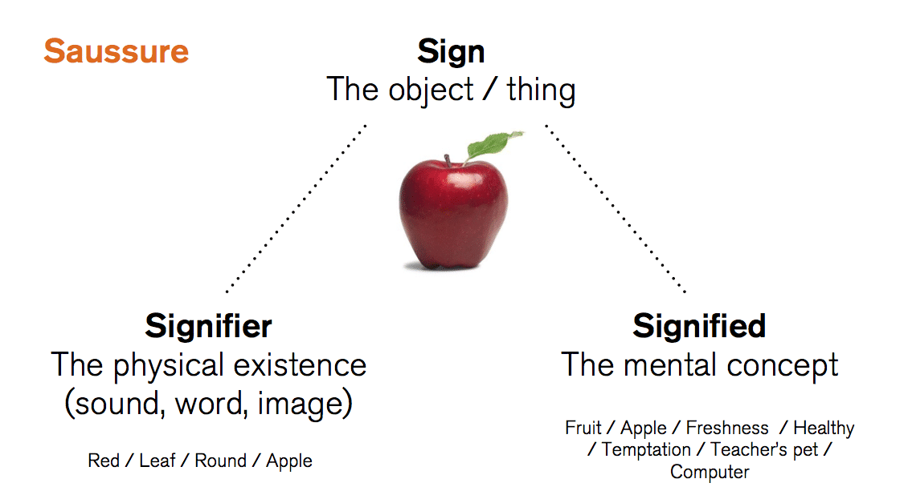

# **Linguistic Extensions**

We hope our comprehensive resources in [Chinese Cuisine](Chinese Cuisine.md) have given you a delicious taste of Chinese food culture’s magic! (๑ᵔ⤙ᵔ๑)

Now, let’s dive deeper through a ==**linguistic lens**== – this module will decode the hidden language behind your taste buds, helping you understand (and conquer!) those pesky dining adaptation challenges with scholarly flair and practical fun!

!!! note "🕵🎯"
    Remember how we, as ambitious change-makers, spotted those little language-related hiccups international friends face when ordering campus meals? (Details in [Home Page](index.md))

Through our interactive games in [Jiangnan Flavor Event](Event Snapshots.md/#our-games), we’ve collected golden nuggets of real-world data – and we’re excited to employ them at on research and share the juicy findings!

Here’s the grand linguistic feast we’ve prepared (≧ᗜ≦)

-   **Culinary Semiotics**
    
    ---

    

    [Check them!](Culinary Semiotics.md){.md-button}

-   **Culinary Phonetics**
    
    ---

    

    [Check them!](Culinary Phonetics.md){.md-button}

-   **Semantic Field Theory**

    ---

    

    [Check them!](Semantic Field Theory.md){.md-button}

-   **Sociolinguistics**

    ---

    

    [Check them!](Sociolinguistics.md){.md-button}

Follow us through this **gastronomic linguistics quest** where:

- 📋 Every **menu character** becomes a storytelling brushstroke

- 🥂 Each **dining interaction** transforms into a cross-cultural win

- 🙋‍♂️ Awkward "I-point-at-random" moments evolve into **confident exchanges**

By the end? You’ll be wielding Chinese food expressions like a seasoned gourmet – whether debating "dry-pot vs. hotpot" or charming street vendors into giving you the locals-only discount! (っ˘ڡ˘ς) 🥢💫