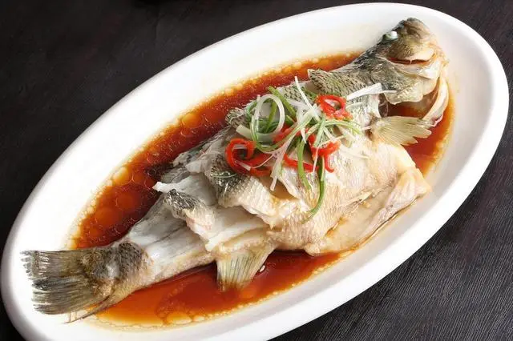
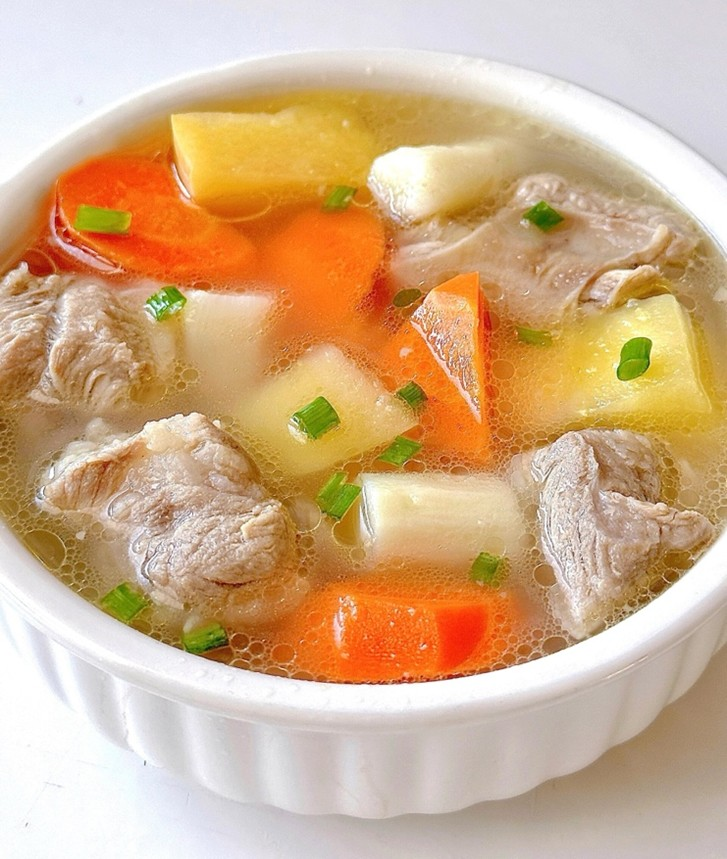

# **Semantic Field Theory**
 
!!! tip "(づ> v <)づ🥢"
    Navigating Linguistic Taboos in Chinese Dietary Culture

**Semantic Field Theory** posits that words derive meaning through their relationships within a structured lexical network, where concepts cluster into thematic domains (e.g., "color," "kinship," or in our context—"food").

This theory illuminates how:

- **👨‍👨 Hierarchies** emerge (e.g., "meat" → "pork/beef")
- **🌍 Cultural values** embed in vocabulary (e.g., 米 "rice" as a core Chinese field)
- **🤐 Taboos** manifest as lexical gaps or substitutions

Within culinary semantic fields, taboos act as *"lexical landmines"*—words avoided due to:

-   **Phonetic Triggers**

    ---
    
    (e.g., "梨" (pear) ≈ "离" (separation) → avoided at weddings

-   **Morphological Taboos**

    ---
    
    (e.g., "醋" (vinegar)隐喻嫉妒 → replaced by "忌讳语"

-   **Pragmatic Constraints**

    ---
    
    (e.g., funeral feast menus omitting "红" (red))

China’s culinary traditions are a symphony of flavors, rituals, and symbolism. But beyond chopsticks and steaming dishes lies an invisible layer of **linguistic etiquette**—==**taboo language**== (禁忌语 jìnjìyǔ)—that shapes dining interactions.

For our international friends, understanding these unspoken rules is key to avoiding cultural faux pas and building meaningful connections. 
    
!!! tip "(๑>◡<๑)🌈⛅️✨"
    
"To study food taboos is to map the fault lines of a culture’s semantic universe."

 

## 🔇 Harmony Over Discord: The Power of Homophonic Taboos 🚫

Chinese culture places immense weight on **homophonic symbolism** (谐音文化 xiéyīn wénhuà), where words sounding like "unlucky" terms are avoided during meals. 

!!! question "Why?🧐"
    This practice stems from ancient beliefs that language carries qi (气 energy) that can influence reality.

Examples to Avoid:

1. "Death" (死 sǐ): The ultimate taboo. Never say, "I’m done eating" (我吃完了 wǒ chī wán le) —wán (完) sounds like "to perish." Instead, say "I’m satisfied" (我吃饱了 wǒ chī bǎo le). 🍚→🙏

2. "Four" (四 sì): Sounds like 死 (sǐ). Avoid ordering four dishes or mentioning the number at formal dinners. Opt for "double pairs" (双数 shuāngshù) instead. 🚫

3. "Separate" (分 fēn): Evokes breakup symbolism. Never split a whole fish or say "Let’s divide the food." A whole fish (鱼 yú) symbolizes abundance, as it homophones with "surplus" (余 yú). 🐟=💵

!!! tip "Pro Tip:"
    When passing dishes, say "Please enjoy" (请用 qǐng yòng) instead of "Here you go" (给你 gěi nǐ), as gěi can imply charity, unsettling guests.

 

## 🧧 Symbolism & Metaphor: When Food Becomes Language 🎋

Chinese cuisine is a metaphor-rich universe. Certain words disrupt this symbolic harmony and are thus avoided:

1. Upside-Down Taboos:

    - Turning a fish over (翻鱼 fān yú) symbolizes capsizing a boat. Say "Turn the fish around" (调转鱼头 diàozhuǎn yú tóu) instead. ⚓→🌀

    - Placing chopsticks vertically in rice (竖筷子 shù kuàizi) resembles incense for the dead. Rest them horizontally! 🥢↔️

2. Illness & Poverty References:

    - Avoid asking "Why aren’t you eating?" (你怎么不吃？ nǐ zěnme bù chī?). It implies the host’s food is unappetizing or the guest is ill. 🤒→😶

    - Never joke about food shortages. Saying "This tastes like prison food" insults the cook’s effort. 🚔→🔥

3. Tea Taboos:

    - Pouring tea with a backwards kettle spout (壶嘴对人 hú zuǐ duì rén) is aggressive—it "points" at guests. Always rotate the pot! 🫖🔄
        
      

    - Tapping the table (叩手礼 kòu shǒu lǐ) is a silent "thank you" for tea—but overdoing it seems impatient. ⏳→👌

 

## 🎎 Face & Politeness: The Social Dance of Dining 🕺💃

Chinese communication prioritizes "face" (面子 miànzi) and **indirectness**. Direct language about food can unintentionally shame others.

!!! note "🔥"
    
Grice’s Cooperative Principle vs. Chinese Politeness:

While Western cultures value clarity (Grice’s maxims), Chinese dining etiquette often bends rules to preserve harmony:

-   
**Maxim of Quantity⚖️**

    ---
    
    Instead of bluntly refusing food, say "I’ll try a little" (我尝一点 wǒ cháng yīdiǎn), even if full. 🍛→🙆

-   
**Maxim of Quality🌟**

    ---
    
    Hosts may insist "There’s nothing to eat!" (没什么菜 méi shénme cài) as humility, though the table is full. Respond with praise! 🎇

🤝 Politeness Principle in Action:

- Tact Maxim: Use honorifics like "Please have more" (请多用 qǐng duō yòng) instead of commands.

- Approbation Maxim: Compliment specific dishes, e.g., "This soup is heavenly!" (这汤鲜得不得了！ zhè tāng xiān de bùdéliǎo!). 🍲→👼

 

## 🌐 Modernity Meets Tradition: Evolving Taboos 📱

Younger generations playfully adapt taboos while respecting their roots:

-   **Euphemistic Slang**
    
    ---

    {.float-left}
    
    "Cola" (可乐 kělè) becomes "happy water" (快乐水 kuàilè shuǐ) to avoid the morbid homophone "throat cancer" (喉癌 hóu ái). 

    !!! tip 
        This mirrors how English speakers say 'bunny' instead of 'rabbit' when fishing (to avoid bad luck), but with Gen-Z creativity!ദ്ദി(˵ •̀ ᴗ - ˵ ) ✧

-   **Digital Dining**

    ---

    Sending 🍅 emojis replaces saying "tomato" (番茄 fānqié)—fān echoes "to overturn."

-   **Global Influences**

    ---

    Saying "Cheers!" (干杯 gānbēi) is now acceptable, though traditionally "dry cup" implied reckless drinking. 🍻→🌍

 

## 🎯 Key Takeaways for International Students 📚

-   **Observe First, Then Join In 👀→🗣️**

    ---

    In new situations, take a moment to gently observe how locals speak—their phrases, tones, and ways of expressing needs. Whether ordering food or chatting, mirroring their language naturally can help you blend in smoothly. 
    
    !!! tip
        There’s no rush to perfect it right away; small, patient steps will make you feel more confident over time!(≧ヮ≦) 💕

-   **Embrace a Humble, Open Spirit 🙇→❤️**

    ---

    When sharing your preferences, use soft, inclusive language like “I’m happy with whatever you choose” (随你 suí nǐ). This shows respect for others’ choices and creates a warm, welcoming vibe. No need to worry about “getting it wrong”—people will appreciate your effort to connect!

-   **Playful Words for Happy Misunderstandings 🍶→😉**

    ---

    For words with dual meanings, try playful alternatives to avoid confusion. For example, “eating vinegar” in Chinese is "吃醋"(chīcù), which can also mean “to be jealous.”
    
    ( ｡ •̀ ᴖ •́ ｡)

    
    
    Instead, try calling it “sweet and sour sauce” (酸甜汁 suāntián zhī) when talking about the condiment! It’s a lighthearted way to navigate cultural quirks and share a smile.

 
!!! tip "(づ> v <)づ🌈⛅️✨"
    By mastering these linguistic nuances, you’ll not only savor China’s culinary delights but also the deeper poetry of its cultural soul.🪭

As the proverb says: 

"A dish without salt is tasteless; a meal without etiquette is hollow."

 (菜无盐无味，饭无礼无趣)

Happy feasting—and phrasing! 🥟🎉🌏 