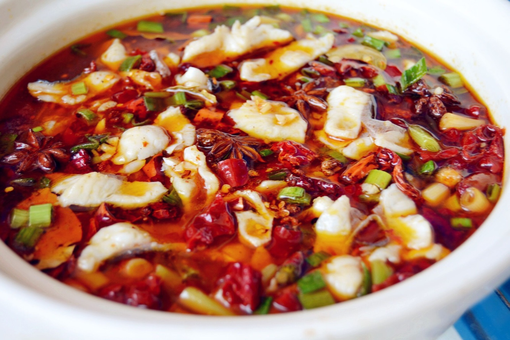
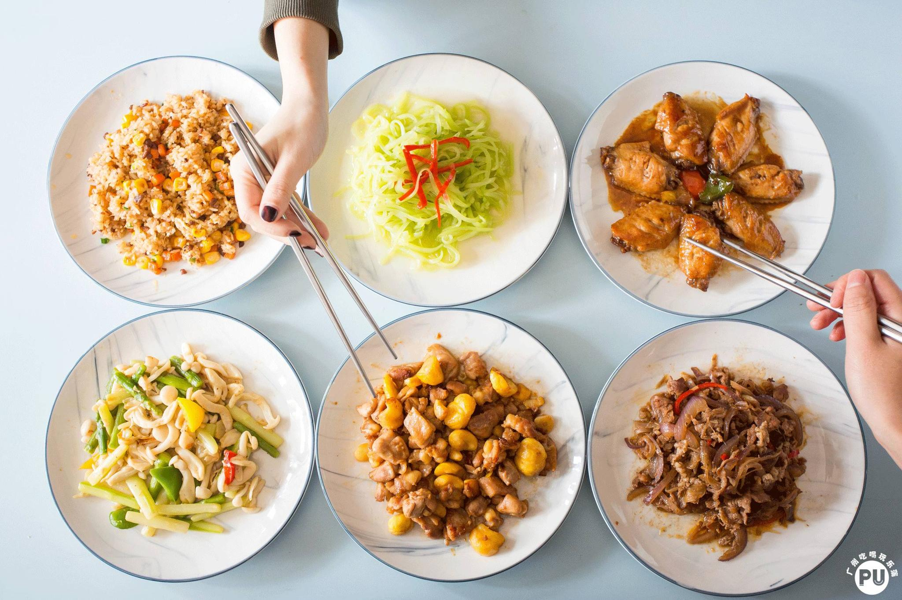
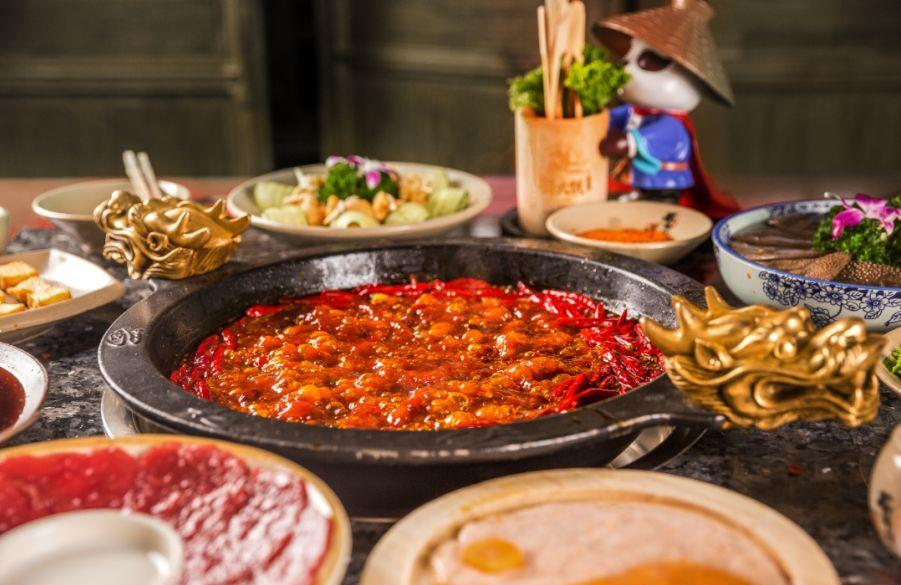

# **Sociolinguistics**

!!! tip "(づ> v <)づ✨"
    Dining in China: The Ultimate Guide for International Students 🍜

Living in China as an international student is an exciting chance to immerse yourself in one of the world’s most diverse and flavorful food cultures!

But while it’s an adventure for your taste buds, it can also be a little challenging, especially with **language barriers** and **cultural differences** in dining. Whether you’re enjoying a meal at a restaurant or ordering food through an app, understanding some basic tips can really make the experience more enjoyable. 

Here’s your ultimate guide to **navigating China’s dining scene** like a pro! 😋

---

## **Ordering Food Offline: Language and Culture Insights 🍽️**

### **Menu Translations May Be Misleading 🧐**

While many Chinese restaurants offer English menus, the translations don’t always capture the full essence of the dish. For example, "水煮鱼" (literally "boiled fish") doesn’t convey its bold, spicy, and numbing flavor (麻辣) that makes it a beloved dish. 🌶️

!!! tip
    If you’re unsure about a dish, don’t hesitate to ask the staff for more details or recommendations. They’ll often be happy to explain the dish, and you might discover some hidden gems you wouldn’t have noticed otherwise.

Fetch our more detailed toolkit for menu decoding in [Culinary Semiotics](Culinary Semiotics.md)✨.

---

### **Must-Know Chinese Phrases for Dining 🗣️**

Here are some helpful phrases to use when ordering in person:

| Situation     | Short Chinese Expressions              |
| ------------- | -------------------------------------- |
| Allergies     | "不要花生，过敏" (No peanuts, allergy) |
| Spice Level   | "微辣/不要辣" (Mild spicy/No spice)    |
| Vegetarian    | "不要肉" (No meat)                     |
| Food Temp     | "冰的/热的" (Iced/Hot)                 |
| Sauce Request | "酱分开" (Sauce separate)              |

!!! tip "Pro Tip"
    Don’t forget to add "谢谢" **(xièxie)** at the end to sound polite! 😊

---

### **Cultural Differences in Dining 🍲**

As mentioned in [Chinese Culinary Culture](Chinese Culinary Culture.md), Chinese dining culture typically revolves around **sharing meals**, which might feel different from the Western habit of ordering individual dishes. Instead of each person getting their own plate, you’ll often find several dishes placed on the table for everyone to enjoy together.  

!!! tip
    Embrace the shared dining experience! It’s a fun way to taste a variety of flavors. If you’re not comfortable with super spicy dishes, simply **let the staff know**, and they can adjust the spice level to suit your preferences.

---

### **Cultural Alerts ⚠️**

-   **🍽️ Portion Size**
    
    ---
    
    "Small" portions often mean 2-3 servings, so it's safe to start with 2 dishes per person.

-   **💸 Hidden Charges**

    ---
    
    Always ask, "免费吗?" (Is it free?) to check if there are charges for things like tea or napkins.

-   **⏳ Time Tricks**

    ---
    
    "马上" (soon) usually means 10-15 minutes. If you need it quicker, ask "15分钟能好吗?" (Ready in 15 minutes?)

---

## **Food Delivery Apps: Navigating the Digital World 📱**

### **English Translations Aren’t Always Accurate 🤔**

Food delivery apps like Meituan and Ele.me are incredibly convenient, but their English translations can sometimes be confusing. For example, "宫保鸡丁" (Kung Pao Chicken) is well-known, but the translation doesn’t capture the special cooking techniques or cultural significance of the dish. 🐔

!!! tip
    When in doubt, do a quick online search to better understand the dish’s ingredients and flavors. You can also ask friends or fellow students who have tried the dish for advice.

---

### **Search Like a Local 🔍**

When searching for food on delivery apps, use the formula: **[Cuisine Theme]** + **[Cooking Techniques]** (e.g., "四川 麻辣烫" for Sichuan spicy soup). This helps you find exactly what you’re craving, and it’s a trick locals use to filter through the thousands of options. 📲

!!! tip "(づ> v <)づ🌈⛅️✨"
    For detailed information about the formula, check our previous pages of [Chinese Cooking Techniques](Chinese Cooking Techniques.md) & [Chinese Cuisine in ZJU](Chinese Cuisine in ZJU.md)

For special requests, you can add "备注" (notes), such as:  

- "放门口" (Leave at door)  
- "不要打电话" (No phone call)

!!! tip "Pro Tip"
    Screenshot your order details if there are any issues with your order, as it can make dealing with customer service much easier.

---

### **Lack of Cultural Context 🏮**

Food delivery apps rarely explain the cultural significance of dishes. For example, "麻辣火锅" (spicy hotpot) is a staple, but its rich cultural history might not be clear without a bit of background knowledge. 🫕

!!! tip
    A quick search online can provide useful information about the dish, and don’t be afraid to ask others for their insights. This can enhance your appreciation of the dish and make the experience more enjoyable.

---

## **Emergency Solutions & Communication Hacks 🚨**

!!! note
    "A prepared traveler turns crises into stories worth laughing about later!" 😉

While culinary adventures in China are overwhelmingly delightful, it's wise to be prepared for rare mishaps.(,,>ࡇ<,,)

Here are a few quick Chinese phrases to use in case of an emergency:

| Emergency Scenario | Mandarin Phrase (Pronunciation)                              | Pro Tip                                       |
| :----------------- | :----------------------------------------------------------- | :-------------------------------------------- |
| **Severe Allergy** | "请叫救护车！我严重过敏！" (Qǐng jiào jiùhùchē! Wǒ yánzhòng guòmǐn!) | Record allergy sources for analysis           |
| **Wrong Order**    | "这道菜上错了" (Zhè dào cài shàng cuò le)                    | Snap a photo of menu + wrong dish as evidence |
| **Food Poisoning** | "我食物中毒了，需要去医院" (Wǒ shíwù zhòngdú le, xūyào qù yīyuàn) | Keep food samples for testing                 |
| **Lost Item**      | "我的手机/钱包落在餐桌上了" (Wǒ de shǒujī/qiánbāo là zài cānzhuō shàng le) | Use WeChat "附近的人" to track nearby devices |

Remember, if you face serious issues with food or service, China’s consumer hotline is **12315**. 📞

---

### **Non-Verbal Communication ✋**

Sometimes, gestures can communicate things more effectively than words. Here are a few non-verbal cues you can use:

| Gesture         | Meaning         |
| --------------- | --------------- |
| ✋ Palm push     | "Stop serving"  |
| 👉 Point to menu | "I want this"   |
| 🤏 Pinch fingers | "Small portion" |
| 📝 Air writing   | "Bring bill"    |

!!! tip "Pro Tip"
    Nodding while saying "对" (duì) confirms your requests, ensuring smooth communication. 👍

---

## **Final Tips for Enhancing Your Dining Experience 🌟**

Whether you're dining offline or ordering via an app, a little preparation can go a long way in improving your experience:

-   **Multilingual Support**

    ---
    
    Many restaurants and delivery apps offer customer service in multiple languages. If you encounter any issues with your order (like a wrong dish or incorrect spice level), don’t hesitate to reach out to **customer support**. They can help resolve problems quickly. 🤝

-   **Cultural Sensitivity**

    ---
    
    Be aware of the dining customs and etiquette, like avoiding sticking chopsticks upright in rice (which is a funeral ritual) or crossing your chopsticks (which signals you're finished eating). 

    !!! tip
        Dig out more about dining etiquette in our previous page [Chinese Culinary Culture](Chinese Culinary Culture.md)✨

-   **Personalized Recommendations**

    ---
    
    Most apps keep track of your previous orders and suggest dishes based on your preferences. Take advantage of this feature to explore new dishes you might enjoy! 🌶️

---

## **Final Thoughts: Enjoy the Journey! 🥳🎉✨**

Hey there!👋

I'm gonna drop a portal right here! For all you awesome readers out there who prefer to skip around while browsing the web, if you haven't delved into our incredibly exciting **Event Snapshots** or our rich and diverse **Comprehensive Resources** yet, you absolutely can't let this opportunity slip through your fingers!

-   
**👉Event Snapshots**

    ---

    

    [==→ Event Snapshots==](Event Snapshots.md){ .md-button }

-   
**👉Comprehensive Resources**
    
    ---

    

    [==→ Chinese Cuisine==](Chinese Cuisine.md){ .md-button }

!!! tip "(づ> v <)づ🌈⛅️✨"
    These sections are filled with a treasure trove of information, interesting stories, and valuable insights that are just waiting for you to explore. 

And hey, as you enjoy your time in China, I sincerely hope that every single meal you have here is a burst of joy and satisfaction! ( ⸝⸝´꒳`⸝⸝)

Living and studying in China is an incredible opportunity to dive into the country’s rich culinary culture. Yes, there may be some bumps along the way—whether it's confusing translations, unfamiliar food, or unexpected delivery issues—but with a bit of patience, flexibility, and a sense of adventure, you’ll quickly find yourself navigating the dining scene like a local. 🍜

!!! tip "(づ> v <)づ🌈⛅️✨"
    Be open-minded and adventurous in your food journey. Don’t be afraid to ask questions, try new things, and most importantly, enjoy the incredible variety of flavors that China has to offer.

Happy eating, and share your experiences with your fellow friends! 🎉🌏👩‍🍳

