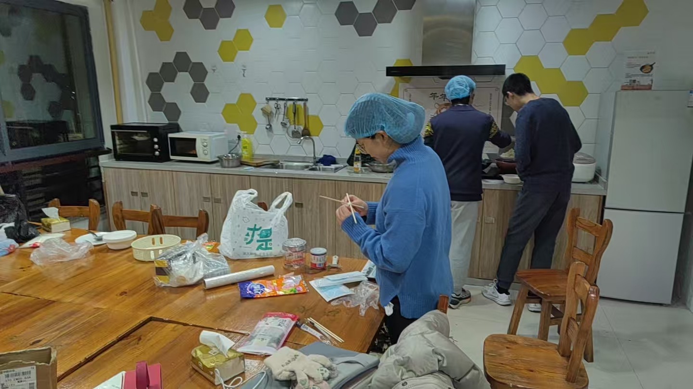
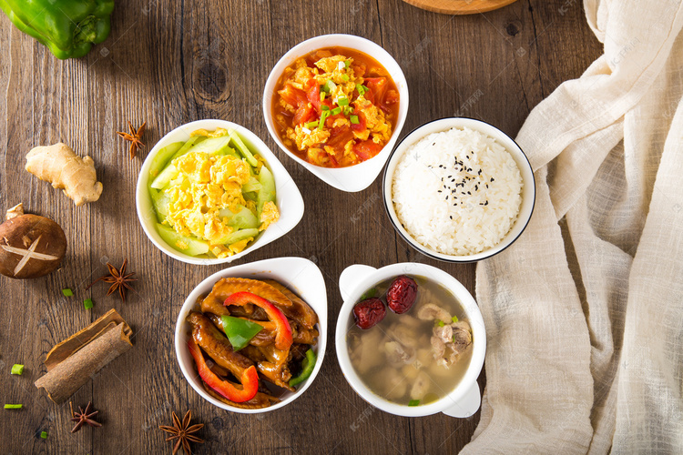

# **Welcome!**🎉

???+ question "What's This Site (๑•᎑•๑)"
    This is a site summarizing our **SQTP** Results (˶˃ ᵕ ˂˶)

    As a group of **freshmen in ZJU**, we are taking an active part making a   difference: helping ==**make Chinese food more enjoyable**== for ya~

???+ question "What Is SQTP ( ╹ -╹)?"
    ​The SQTP (Student Quality Training Project) is a "Dream Boosting Initiative" focused on student development, designed to help students achieve their aspirations for enhancing individual or group capabilities and qualities. Guided by the fundamental principle of cultivating virtue through education, the program emphasizes **student-led:** 
    
    

    - 📝 **Application**
    - 🔍 **Evaluation**
    - 🛠️ **Implementation**

    

    
    with professional instructors providing mentorship. 

    Through the process of:
    
    

    - 👥 **Team Formation**

    - 💡 **Project Proposal**

    - 📊 **Management Execution**

    - 🏆 **Final Evaluation**

    

    
    Students actively engage in:
    
    

    - ✨ **Critical Thinking**
    - 🧭 **Exploratory Learning**
    - 🎯 **Motivation Cultivation**

    

    thereby comprehensively improving their overall competencies.

Themes for SQTP applications include categories such as **student development**, **collective building**, and **campus life**.

As a comprehensive specialized training program for quality and capability development, the SQTP’s content design should incorporate three core modules:

-   :material-book:{ .abc } __Theoretical Knowledge Module__

    ---

    Strengthening foundational theories related to capability and quality enhancement

-   :simple-searxng:{ .abc } __Simulation Training Module__

    ---

    Fostering self-guided experiential learning through practical simulations

-   :fontawesome-solid-hand-sparkles:{ .abc } __Practical Application Module__

    ---

    Internalizing theoretical knowledge via real-world implementation and reflection

# Our SQTP🌟
Welcome to our **SQTP Dream Boosting Initiative**! As ZJU freshmen, we're passionate about making Chinese cuisine more accessible and enjoyable for international students. Through **culinary exploration** and **linguistic research**, we're bridging taste bud gaps one bite at a time! (˶ᵔ ᵕ ᵔ˶)

???+ tip "(づ> v <)づ🌈⛅️✨"
    
Food is the universal language, but sometimes we need a translator for our taste buds!✨

​Themed ==**"Taste Bud Frontiers Decoded: Overcoming International Students' Food Adaptation Challenges"**==, our SQTP perceived the phenomenon that some international ZJUers experience varying degrees of ==**culinary acculturation stress**== when encountering authentic Chinese cuisine. What's more, from linguistic perspective we note another intriguing phenomena worthy of attention : Some international students lack familiarity with ==**Chinese culinary vocabulary**==, hindering their ability to articulate dietary preferences and exacerbating challenges in adapting to campus Chinese dining.

-   :tongue:**Chinese Food Texture Vocabulary**

    ---

    How do I describe "crispy" "chewy" "slippery" texture in Chinese? (,,>ࡇ<,,)

-   :cooking:**Chinese Culinary Cooking Techniques**

    ---

    What distinguishes "煎","炒","烹","炸","蒸","煮","炖","煲","烧","焖","熘","烤" ( ꩜ ᯅ ꩜;) 

-   :cold_sweat:**Meal Order in Chinese**

    ---

    How to express "No coriander PLZ🥹!" in Chinese? ( ˶o˶˶o˶) !!

This culinary acculturation stress creates real barriers to enjoying campus dining. But we're changing that! 💪

​Based on such observations, our team actively engages in the SQTP initiative to ==**facilitate international students’ adaptation to campus Chinese cuisine**==. We do hope that through our efforts:  

-   :cooking:{ .lg .middle } __Hand-on Cooking Practice__

    ---

    Practical culinary experience of ==**making our Creamy Yam Purée**==

    - Western-friendly textures
    - Chinese characteristic ingredient
    - 3 sauce variations(๑˃ᴗ˂)ﻭ

    

    

    See our hand-on adventures in:
    [==→Event Snapshots==](Event Snapshots.md){.md-button .md-button--white .small}

    

-   :confetti_ball:{ .lg .middle } __Research via Activities__

    ---

    Engaging in the ==**New Year Gala**== organized by ISU
    
    - Presenting unique cuisines
    - Collecting food vocabulary samples through our "Tell Your Taste Bud's Story" game 
    - building flavor-language bridges( • ᴗ - ) ✧

    

    

    View our funpacked research in:
    
    [ ==→Event Snapshots==](Event Snapshots.md){.md-button}

    

-   :material-human-greeting-proximity:{ .lg .middle } __In-depth Linguistic Analysis__

    ---

    Probing into core issues with regard to:

    - **Semiotics**
    - **Phonetics**
    - **Semantics**
    - **Sociolinguistics**

    

    

    View our linguistic part in:

    [==→Linguistic Extensions==](Linguistic Extensions.md){.md-button}

    

-   :bookmark:{ .lg .middle } __Comprehensive Resources__

    ---

    Practical Culinary Toolkit containing:

    - **Chinese Cooking Techniques**
    - **Chinese Culinary Culture**
    - **Campus Dining** Survival Guide(≧∇≦)

    

    

    View our comprehensive resources in:
    [==→Chinese Cuisine==](Chinese Cuisine.md){.md-button}

    

​We hope through our SQTP we could provide targeted solutions to help both audiences:

-   🪭 **For Chinese Students**

    ---

    - Explain Culinary Concepts
    - Explore Traditional Recipes
    - Learn More About Our Rich Culture Through Games⸜(｡˃ ᵕ ˂)⸝♡

-   🌍 **For International Friends**

    ---

    - Better Adapt to Campus Chinese Cuisine
    - Describe Food Preferences and Order Confidently
    - Gain an Enhanced Appreciation of Chinese Gastronomy(≧ᗜ≦)

???+ tip "(づ> v <)づ🌈⛅️✨"
    
Join us on this tasty adventure as we break down taste bud barriers—one bite, one laugh at a time! 🌟🎉
